=== Prerequisites

This tutorial assumes that you have `maven` version 3.x.x installed on your computer. To create a new, default, maven project, simply type the command `mvn -B archetype:generate -DarchetypeGroupId=org.apache.maven.archetypes -DgroupId=com.mcgill.ca.tutorial3 -DartifactId=tutorial3` in the folder of your choice.

Next we will update the JUnit dependencies. Locate your `pom.xml` file that was created after the above command. The default generated `pom.xml` should look something like:

[source]
----
<project xmlns="http://maven.apache.org/POM/4.0.0" xmlns:xsi="http://www.w3.org/2001/XMLSchema-instance"
  xsi:schemaLocation="http://maven.apache.org/POM/4.0.0 http://maven.apache.org/maven-v4_0_0.xsd">
  <modelVersion>4.0.0</modelVersion>
  <groupId>com.mcgill.ca</groupId>
  <artifactId>tutorial3</artifactId>
  <packaging>jar</packaging>
  <version>1.0-SNAPSHOT</version>
  <name>tutorial-3</name>
  <url>http://maven.apache.org</url>
  <dependencies>
    <dependency>
      <groupId>junit</groupId>
      <artifactId>junit</artifactId>
      <version>3.8.1</version>
      <scope>test</scope>
    </dependency>
  </dependencies>
</project>
----

Change the version number for JUnit from 3.8.1 to 4.12 and remove the `<scope>test</scope> tag`. 

Change the `AppTest.java` class definition to a single empty test:
[source, java]
----
package com.mcgill.ca.tutorial3;

import org.junit.Test;

public class AppTest
{
	@Test
	public void emptyTest() {
	}
}
----

Finally, to make sure everything is working correctly, run the command `mvn clean install` and check that the build succeeded.

No git repository is created for this project. If you already have a repository containing this project and wish to use that one, ignore the steps having the (_Optional_) tag 

This default project will be used in the next sections. 

=== SonarQube Static Code Analysis

This section looks at how to use SonarQube, both integrated with Travis and as a standalone setup.

==== Offline SonarQube Installation

. Navigate to the folder of the working copy of your repository used during the previous tutorial. If you no longer keep a working copy, clone it again.

. Go to the SonarQube main page (https://www.sonarqube.org/) and click on the blue _Download_ button. +
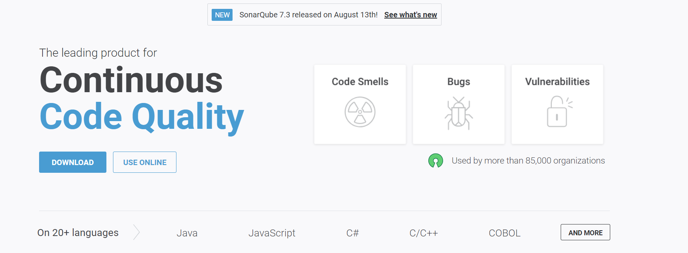

. Click on the blue _Community Edition 7.3_ button + 
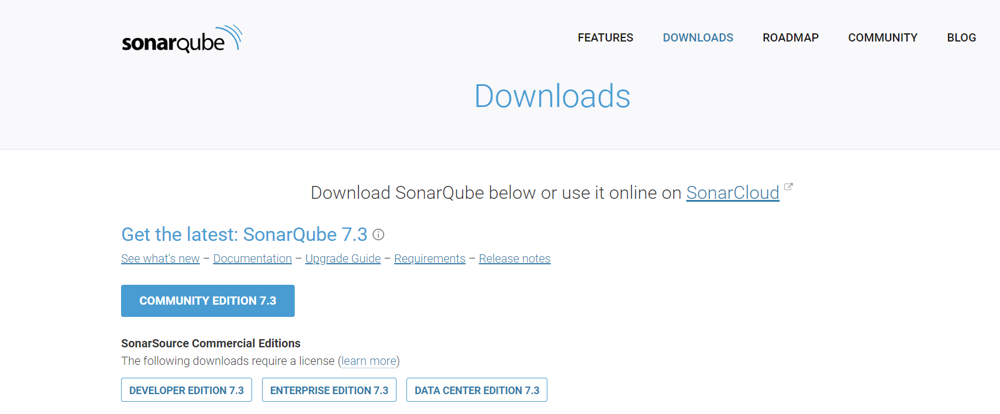

. Extract the sonarqube-7.3.zip to the location of your choice. +
  For this tutorial, we unzipped it in C:\

. Start the SonarQube Server. +
  Assuming you are in the root folder of the sonarqube directory, that is `C:\sonarqube-7.3` this example, you run either: +
  `.\bin\[OS]\StartSonar.bat` for windows or `./bin/[OS]/sonar.sh console` for linux or mac environments. +    
  The OSs that are included are: +
  * windows-x86-32 +
  * windows-x86-64 +
  * macosx-universal-64 +  
  * linux-x86-32 +
  * linux-x86-64 +
In this example, we have a Windows machine, so we use `.\bin\windows-x86-64\StartSonar.bat` as a command. The server should boot and when it is finally ready, you should get an output similar to this +
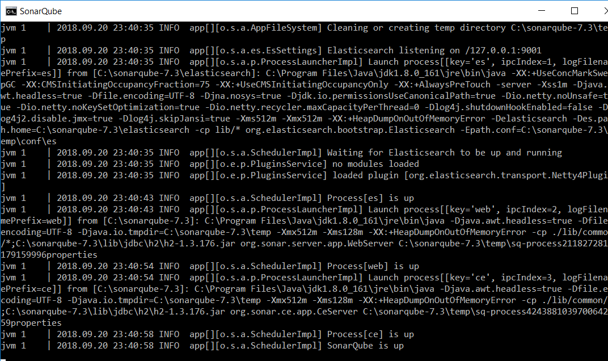 + 
SonarQube created a default webserver at localhost:9000. If you type the latter in your Internet browser, you should get the following page +
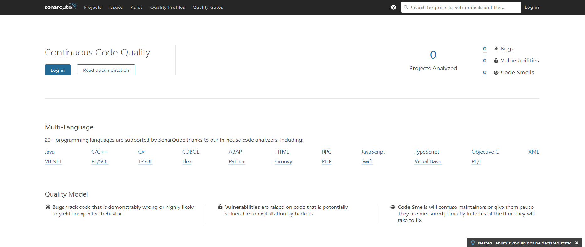  

. Log in the server +
The default account created for your page is admin:admin +
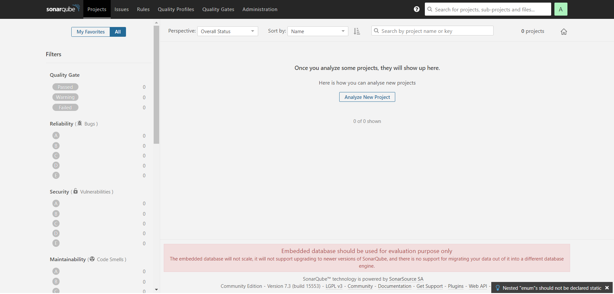

. Create Basic Code Smells in the Project +
Locate the file `App.java` in your maven project and change the class definition to the following: +

[source, java]
----
package ca.mcgill.ecse429;

public class App 
{
    private int x;
	
    public static void main( String[] args )
    {
    	String s = null;
    	System.out.println(s.length());
    }

}
----

8 Edit the `pom.xml` +
Add the Sonar Maven plugin and its configuration to the project (e.g., after the `</dependencies>` closing tag) +

[source,none]
----
...
<build>
	<plugins>
		<plugin>
			<groupId>org.sonarsource.scanner.maven</groupId>
			<artifactId>sonar-maven-plugin</artifactId>
			<version>3.5.0.1254</version>
		</plugin>
	</plugins>
</build>

<profiles>
	<profile>
		<id>sonar</id>
		<activation>
			<activeByDefault>true</activeByDefault>
		</activation>
		<properties>
		<!-- Optional URL to server. Default value is http://localhost:9000 -->
			<sonar.host.url>
				http://localhost:9000
			</sonar.host.url>
		</properties>
	</profile>
</profiles>
...
----
+
[NOTE]
For gradle 2.1 and above, add the following snippet to the build script: +
[source,gradle]
----
plugins {
  id "org.sonarqube" version "2.6.2"
}
----
+
Then, you can run analysis using `gradle sonarqube`


9 Build the Project +
In another terminal, run the command `mvn clean install sonar:sonar` at the root of the project folder +
You should get an output similar to this: +
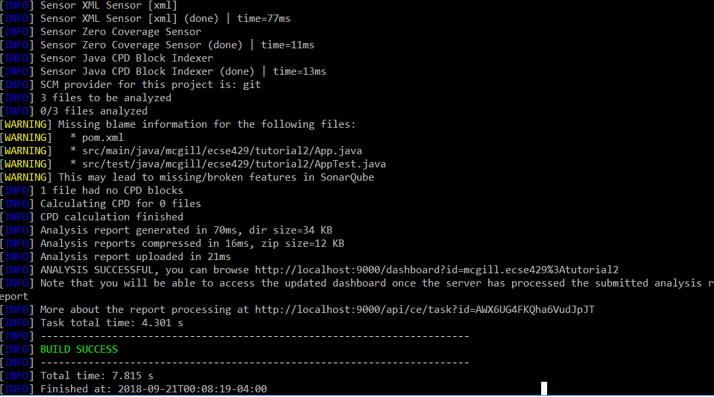 +
If we visit the link in the terminal output (it follows the format of http://localhost:9000/dashboard?id=<INSERT_PROJECT_NAME>), we are brought to a page similar to this: +
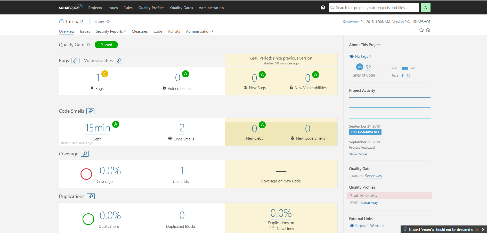 +

10 Investigate the Error Causes:


Click on _Code_ in the toolbar above. Then select the package containing the `App.java` class from the list and click on `App.java` and click on the red icons on the left of your code.

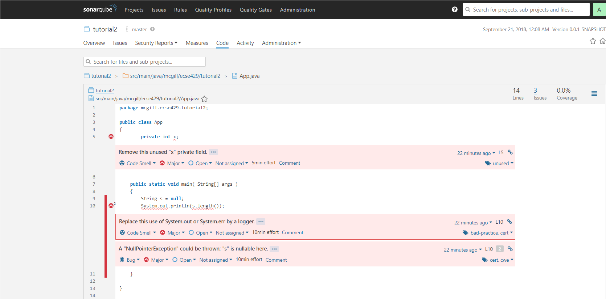

===== Adding Code Coverage

. Edit the `pom.xml` and add a new `profile` somewhere between the `<profiles>` tags
+
[source,none]
----
<profile>
<id>sonar-coverage</id>
<activation>
<activeByDefault>true</activeByDefault>
</activation>
<build>
<pluginManagement>
  <plugins>
    <plugin>
      <groupId>org.jacoco</groupId>
      <artifactId>jacoco-maven-plugin</artifactId>
      <version>0.7.8</version>
    </plugin>
  </plugins>
</pluginManagement>
<plugins>
  <plugin>
    <groupId>org.jacoco</groupId>
    <artifactId>jacoco-maven-plugin</artifactId>
    <configuration>
      <append>true</append>
    </configuration>
    <executions>
      <execution>
	<id>agent-for-ut</id>
	<goals>
	  <goal>prepare-agent</goal>
	</goals>
      </execution>
      <execution>
	<id>jacoco-site</id>
	<phase>verify</phase>
	<goals>
	  <goal>report</goal>
	</goals>
      </execution>
    </executions>
  </plugin>
  </plugins>
  </build>
</profile>
----

. Write a Dummy Test

In `AppTest.java`, substitute `emptyTest` with the following:

[source,java]
----
@Test
public void mainTest() {
    App.main(null);
}
----

3 Run the command `mvn clean install sonar:sonar` once again

4 Use the outputted URL to inspect the changes in SonarQube +

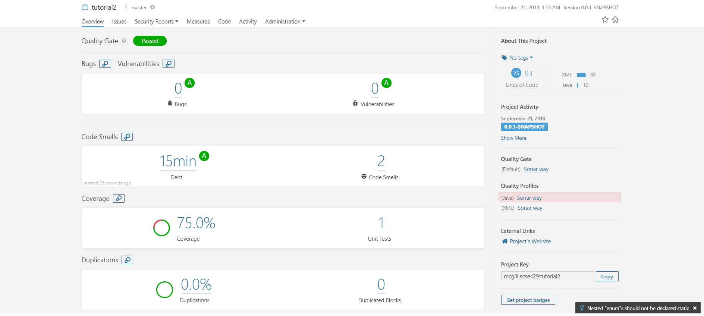

5 Click on the `75%` of the `Code Coverage` Section

6 Click on the `App.java` file in the list

7 Look to the left of the red error icons. We now see which lines were tested by the unit tests. +

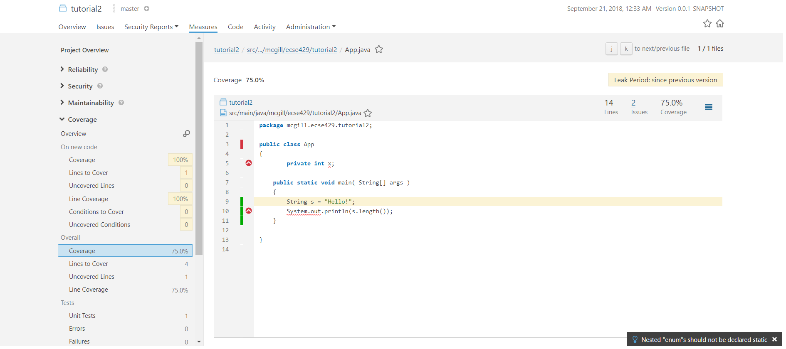

==== SonarQube Integrated With Travis
. Register your Github Account in this link (https://sonarcloud.io/sessions/new?return_to=%2Faccount%2Fsecurity) +
 +
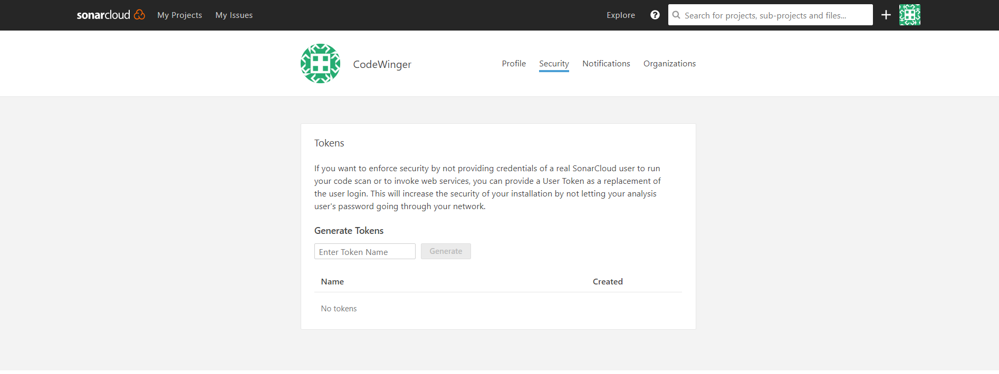

. Add a security token of your choice and store in a file of your choice +
[NOTE]
It is important to copy it somewhere; you will not be able to see it again afterwards + 
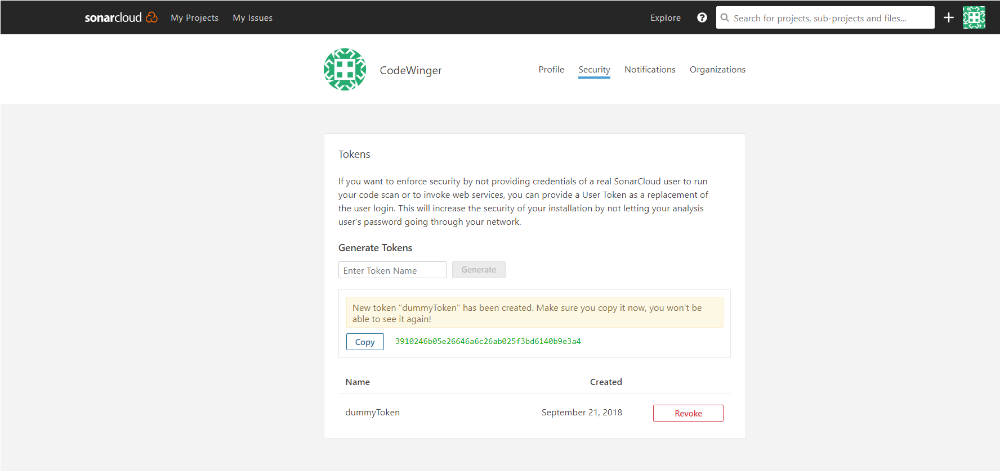

. Click on your picture in the top right-hand side of the toolbar, next to the search bar, then on the button _My Organizations_ +
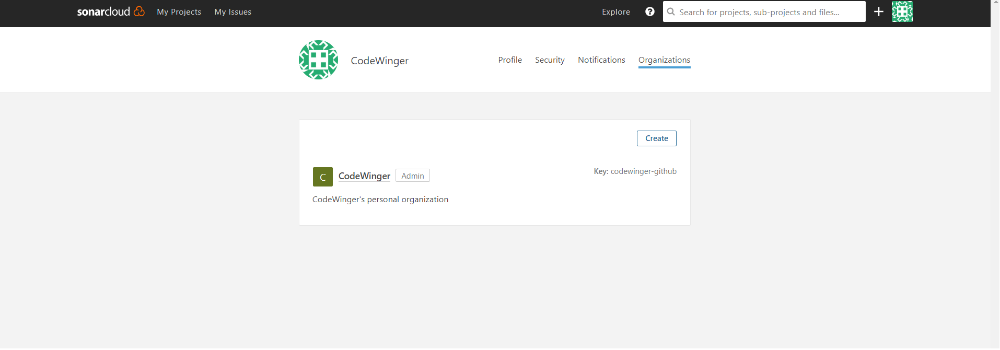

. Jot down the key given by SonarCloud.io under the _Create_ button +

. Add a `.travis.yml` file to the project's directory +
[source,none]
----
language: java
sudo: false
install: true

addons:
  sonarcloud:
    organization: "[YOUR ORGANIZATION KEY]"
    token:
      secure: "[YOUR GENERATED TOKEN]"
   

jdk:
  - oraclejdk8

script:
  - mvn clean org.jacoco:jacoco-maven-plugin:prepare-agent package sonar:sonar

cache:
  directories:
    - '$HOME/.m2/repository'
    - '$HOME/.sonar/cache'
----

For this example, the `addons` section would look like +
[source,none]
----
addons:
  sonarcloud:
    organization: "codewinger-github"
    token:
      secure: "3910246b05e26646a6c26ab025f3bd6140b9e3a4"
----

6 Create a new local repository with the command `git init` (_Optional_) +

7 Create a new upstream repository on GitHub (_Optional_) +
After creating the repository, from the command line enter the commands:
```
git remote add origin https://github.com/[YOUR GITHUB ID]/[YOUR REPO NAME].git
```

In my case, the above would look like:
```
git remote add origin https://github.com/CodeWinger/tutorial3.git
```

8 Add a `.gitignore` file (_Optional_) +
```
# Compiled class file
*.class

# Log file
*.log

# BlueJ files
*.ctxt

# Mobile Tools for Java (J2ME)
.mtj.tmp/

# Package Files #
*.jar
*.war
*.nar
*.ear
*.zip
*.tar.gz
*.rar

# virtual machine crash logs, see http://www.java.com/en/download/help/error_hotspot.xml
hs_err_pid*
```

9 Push your work from the `master` branch to GitHub with the command `git add . && git commit -m "SonarCloud Integration" & git push origin master:master --set-upstream` +
We need to first analyze the `main` branch before we can analyze new branches along with their differences with the `master` branch 
Your output should look something like this: +
image:figs/sonarQube-ci-5.png[Default projects space]

10 Copy the outputted URL (https://sonarcloud.io/dashboard?id=mcgill.ecse429%3Atutorial2, in this case) and paste it in your Internet browser. +
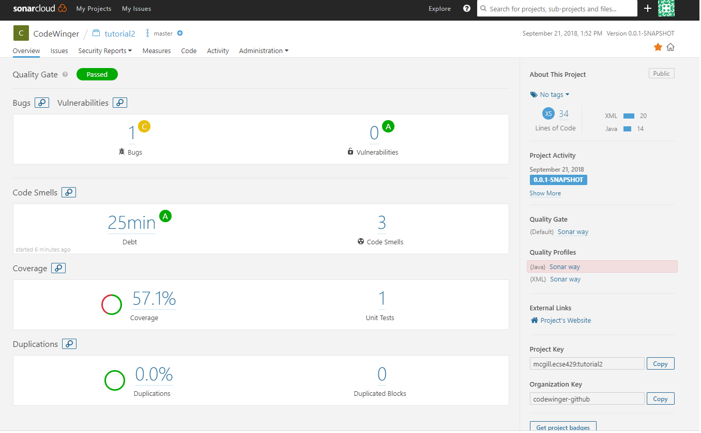

11 From the `master` branch, create and checkout a new branch `git branch sonarqube-travis-integration && git checkout sonarqube-travis-integration`

12 Modify `App.java`'s class definition: +
[source,java]
----
public class App 
{
    public static void main( String[] args )
    {
    	if (args == null || args.length == 0) {
    		System.out.println("no input");
    		return;
    	} 
    	
    	for (String argument : args) {
    		System.out.println(argument);
    	}
    }
}
----
13 Modify `AppTest.java`'s class definition: +

[source,java]
----
import org.junit.Test;

public class AppTest 
{
	@Test
	public void testMainMethodForNull() {
		App.main(null);
	}
	
	@Test
	public void testMainMethodForEmptyArray() {
		App.main(new String[0]);
	}
	
	@Test
	public void testMainMethodForNonEmptyArray() {
		String[] args = {"Hello", "World"};
		App.main(args);
	}
}
----

14 Push your work on the branch and check the output in SonarCloud.io (`git add . && git commit -m "SonarCloud Integration" & git push -u origin sonarqube-travis-integration` +
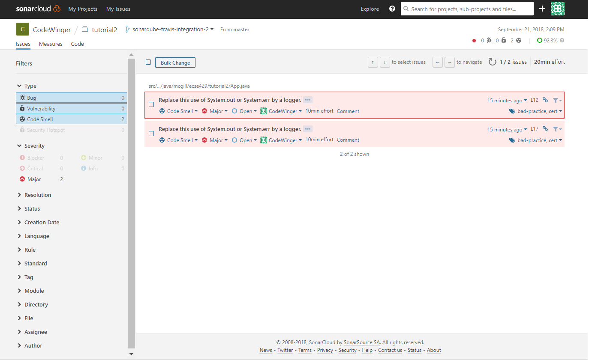

=== SonarCloud integration for Project deliverable

1. One team member is registered to SonarCloud organization McGill ECSE429 Fall2018. Follow the steps with that team member's SonarCloud account.

1. Create a SonarCloud project _under the organization_ (and not under your user). Name it `team-NO-blokish`, where `NO` is the placeholder for the two digit team number. Assign a unique project key to it afterwards as shown below. +
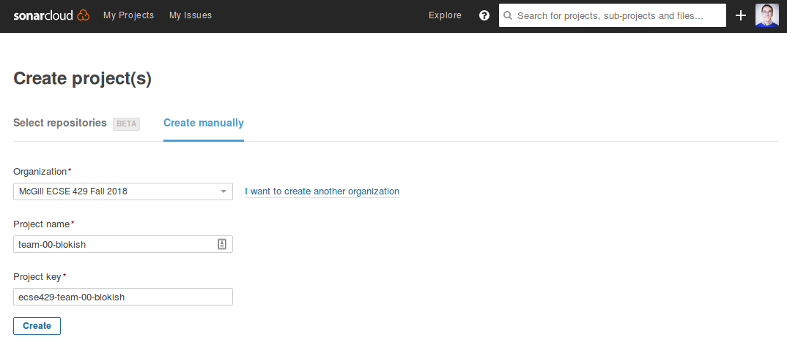

1. Generate an access token for the project.
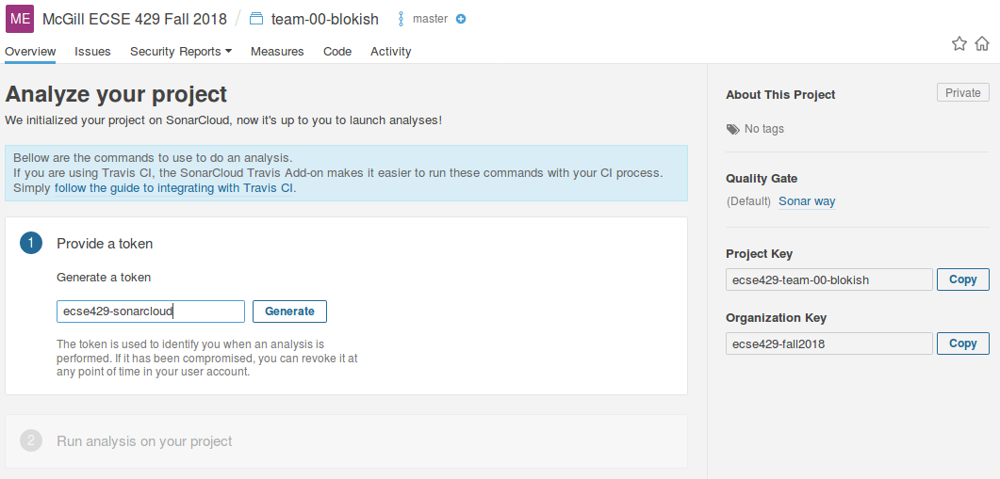

1. On the next page, you will be shown two snippets:
 * one is to be added to the `build.gradle` file
 * the other one is the command you can use out-of-the box to build and analyze on SonarCloud
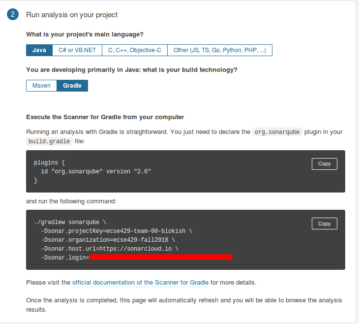

=== Infer Static Analyzer

. Create and checkout a new branch from master (`git branch infer && git checkout infer`) 

. Edit the .travis.yml file: 
+
[source,none]
----
dist: trusty
sudo: required
language: java
jdk: oraclejdk7

script:
 - #TODO: get infer archive and extract it
 - #TODO: add infer executable to the path
 - #TODO: invoke infer with your project
----

. Introduce a null warning
In the default file `App.java`, change the main method to the following:
+
[source,java]
----
public static void main( String[] args ) {
    String s = null;
    System.out.println(s.length());
}
----

. Commit and push the 2 modified files (`commit add . && git commit -m "Added Infer Static Analyzer" && git push -u origin infer`)

. Go to https://travis-ci.com/ to see your build processes. It should look something similar to this: +
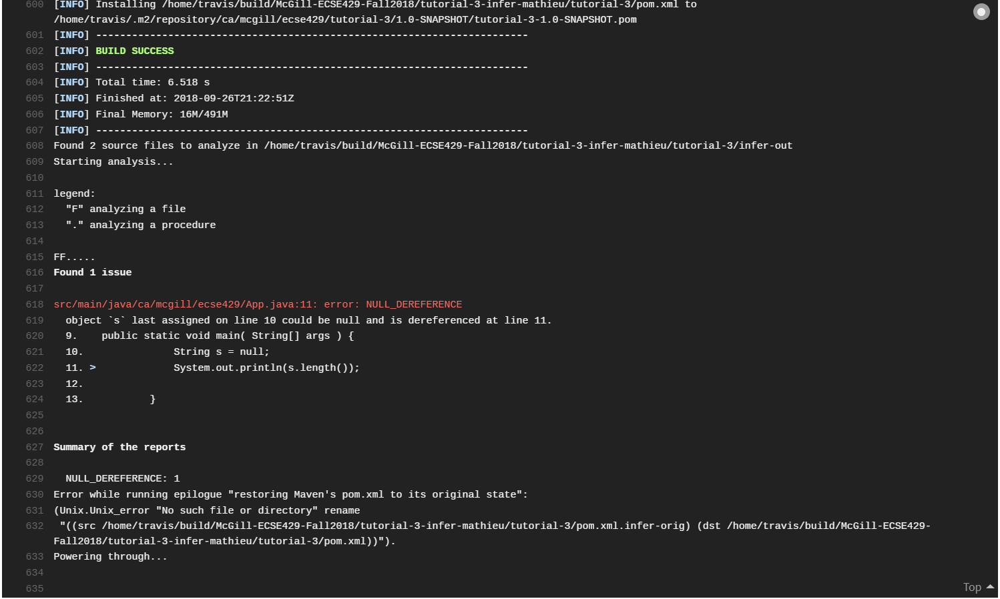
