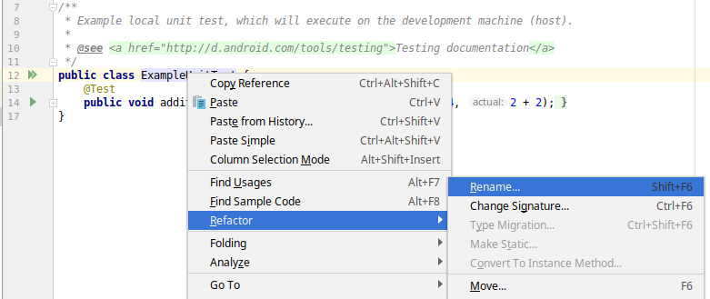

=== Testing Using Mocks

. anchor:initial-project[]Clone (or fork and clone the fork of) the initial project from link:https://github.com/McGill-ECSE429-Fall2018/ecse429-tutorial-7[this link] and import it to Android Studio.

. Open the project with Android Studio and verify that it builds fine from the IDE (or by running the corresponding Gradle wrapper).

. Explore the (not too complex) application sources. Start the app and try its features as well.

. Add the Mockito gradle dependency in `app/build.gradle` for compiling test sources: `testImplementation 'org.mockito:mockito-core:2.23.0'`

. Locate the `ExampleUnitTest.java` and refactor the class' name to `IntegrationTest`. +
 

. Add the following code to the class:
+
[source,java]
----
package ca.mcgill.ecse321.eventregistration;

import com.loopj.android.http.AsyncHttpClient;
import com.loopj.android.http.BlackholeHttpResponseHandler;
import com.loopj.android.http.RequestParams;

import org.junit.Before;
import org.junit.Test;
import org.mockito.Mock;
import org.mockito.Mockito;

public class IntegrationTest {

    @Mock
    AsyncHttpClient httpClient;

    HttpUtils httpUtils;

    @Before
    public void setUp(){
        httpUtils = new HttpUtils(httpClient);
    }

    @Test
    public void testHttpPostCalled() {
        String url = "participants/";
        RequestParams params = new RequestParams();
        BlackholeHttpResponseHandler handler = new BlackholeHttpResponseHandler();

        // Call the SUT
        httpUtils.post(url, params, handler);

        // Verify interactions
        Mockito.verify(httpClient).post(HttpUtils.getBaseUrl() + url, params, handler);
    }
}
----

. Run the test as JUnit test (failure is expected). Try understanding the error message!

. Add the following annotation to the test class. 
+
[source,java]
----
// ... other imports
import org.junit.runner.RunWith;
import org.mockito.junit.MockitoJUnitRunner;

@RunWith(MockitoJUnitRunner.class)
public class IntegrationTest {
    // ...
}
----