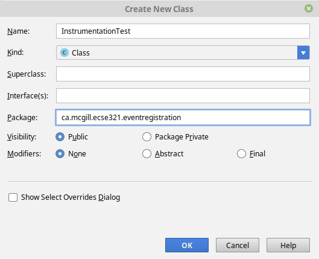

=== Android Instrumentation Tests

With Android, we have previously created *Local tests* that that run on your local machine only. In this tutorial we show how you can create *Instrumented tests*, unit tests that run on an Android device or emulator. See more about the difference between local and instrumentation tests at: https://developer.android.com/training/testing/unit-testing/.

==== Project dependencies and setup

This section takes configurations from the link:https://developer.android.com/training/testing/set-up-project[Android documentation]. You can follow the steps below by reusing the example project from <<07-Testing-Using-Mocks.adoc#initial-project,the first step of the previous section>>.

. Add the used libraries to `<module-name>/src/main./AndroidManifest.xml` *within* the `<application>...</application>` tags
+
[source,xml]
----
<uses-library android:name="android.test.base"
    android:required="false" />
<uses-library android:name="android.test.runner"
    android:required="false" />
<uses-library android:name="android.test.mock"
    android:required="false" />
----

The next few steps will update the module's `build.gradle` file (`<module-name>/build.gradle` file).

. Speficy the used libraries within the `android` task as well.
+
[source,gradle]
----
android { 
    // ... other settings 
    useLibrary 'android.test.runner'
    useLibrary 'android.test.base'
    useLibrary 'android.test.mock'
    // ... other settings 
}
----

. Add the following instrumentation testing dependencies.
+
[source,gradle]
----
dependencies {
    // ... other dependencies
    // Core library  
    androidTestImplementation 'androidx.test:core:1.0.0'
    // AndroidJUnitRunner and JUnit Rules  
    androidTestImplementation 'androidx.test:runner:1.1.0'
    androidTestImplementation 'androidx.test:rules:1.1.0'
    // Assertions  
    androidTestImplementation 'androidx.test.ext:junit:1.0.0'
    androidTestImplementation 'androidx.test.ext:truth:1.0.0'
    androidTestImplementation 'com.google.truth:truth:0.42'
    // Espresso dependencies  
    androidTestImplementation 'androidx.test.espresso:espresso-core:3.1.0'
    androidTestImplementation 'androidx.test.espresso:espresso-contrib:3.1.0'
    androidTestImplementation 'androidx.test.espresso:espresso-intents:3.1.0'
    androidTestImplementation 'androidx.test.espresso:espresso-accessibility:3.1.0'
    androidTestImplementation 'androidx.test.espresso:espresso-web:3.1.0'
    // Add these for applications having significant library dependencies  
    androidTestImplementation 'com.google.dexmaker:dexmaker:1.2'
    // Android-specific Mockito
    androidTestImplementation 'com.google.dexmaker:dexmaker-mockito:1.2:'
}
----
+
[NOTE]
For instrumentation tests only Mockito 1.9.x can be used currently (via the dexmaker dependency).

. Update the `android` task as shown below. You may need to download the new SDK version.
+
[source,gradle]
----
android {
    compileSdkVersion 28
    // ...
    defaultConfig {
        minSdkVersion 18
        targetSdkVersion 28
        testInstrumentationRunner "androidx.test.runner.AndroidJUnitRunner"
    }
    // ...
----

==== Creating an instrumentation test

. Create the `<module-name>/src/androidTest/java` folder structure. This is the default location where the framework will look for instrumentation tests.

. Create a new test class `InstrumentationTest` under the same package name as the package name of the main activity. +
image:figs/create-instrumentaiton-test-class.png[Create instrumentation test class] +

. Add the imports and annotations as follows 
+
[source,java]
----
package ca.mcgill.ecse321.eventregistration;

import android.widget.Button;
import android.widget.ListView;

import com.loopj.android.http.AsyncHttpClient;
import com.loopj.android.http.JsonHttpResponseHandler;
import com.loopj.android.http.RequestParams;
import com.loopj.android.http.ResponseHandlerInterface;

import org.json.JSONArray;
import org.json.JSONException;
import org.json.JSONObject;
import org.junit.Rule;
import org.junit.Test;
import org.junit.runner.RunWith;
import org.mockito.Mock;
import org.mockito.Mockito;
import org.mockito.invocation.InvocationOnMock;
import org.mockito.runners.MockitoJUnitRunner;
import org.mockito.stubbing.Answer;

import androidx.test.filters.SmallTest;
import androidx.test.rule.ActivityTestRule;

import static com.google.common.truth.Truth.assertThat;

@RunWith(MockitoJUnitRunner.class)
@SmallTest
public class InstrumentationTest {

}
----
+
[NOTE]
If you are not planning on using Mockito with instrumentation tests, you can replace the `@RunWith(MockitoJUnitRunner.class)` annotation with `@RunWith(AndroidJUnit4.class)`.

. Within this class, create a private class that passes the JSON answer for a HTTP request via the handler (JSON Handler) extracted from the method call
+
[source,java]
----

private class ParticipantsAnswer implements Answer<JSONArray> {
    @Override
    public Object answer(InvocationOnMock invocation) throws JSONException {
        Object[] arguments = invocation.getArguments();
        JsonHttpResponseHandler h = (JsonHttpResponseHandler) arguments[2];
        h.onSuccess(200,null,new JSONArray()
                .put(new JSONObject().put("name", "P1"))
                .put(new JSONObject().put("name", "P2"))
                .put(new JSONObject().put("name", "P3")));
        return null;
    }
}
----

. Add fields to the `InstrumentationTest` class
+
[source,java]
----
@Mock
AsyncHttpClient httpClient;

@Rule
public ActivityTestRule<MainActivity> activityTestRule = new ActivityTestRule<>(MainActivity.class);
----

. Add the implementation to the test case
+
[source,java]
----
@Test
public void aTest() throws Throwable {
    final MainActivity mainActivity = activityTestRule.getActivity();
    mainActivity.setHttpUtils(new HttpUtils(httpClient));

    Mockito.when(httpClient.get(Mockito.anyString(),Mockito.<RequestParams>anyObject(), Mockito.<ResponseHandlerInterface>anyObject())).thenAnswer(new ParticipantsAnswer());

    final ListView participantList = mainActivity.findViewById(R.id.participant_list);
    final int numberOfParticipants = participantList.getAdapter().getCount();

    assertThat(numberOfParticipants).isEqualTo(0);

    Button button = (Button) mainActivity.findViewById(R.id.button);
    button.performClick();

    int numberOfParticipants2 = participantList.getAdapter().getCount();
    assertThat(numberOfParticipants2).isEqualTo(3);
}
----

. After right clicking on the class you can run the instrumentation test. Select the virtual device to run the tests on.

. The tests failed. Try understanding the error message!

. Fix the tests by including the last part of the test in  `runOnUiThread()`
+
[source,java]
----
activityTestRule.runOnUiThread(new Runnable() {
    @Override
    public void run() {
        Button button = (Button) mainActivity.findViewById(R.id.button);
        button.performClick();
        int numberOfParticipants2 = participantList.getAdapter().getCount();
        assertThat(numberOfParticipants2).isEqualTo(3);
    }
});
----

. Finally, exploit the _Fluent API_ of Mockito and clean up your code. Import all static methods with `static import`!