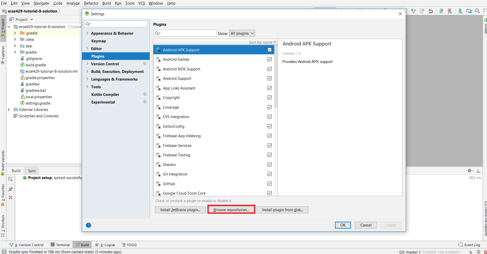
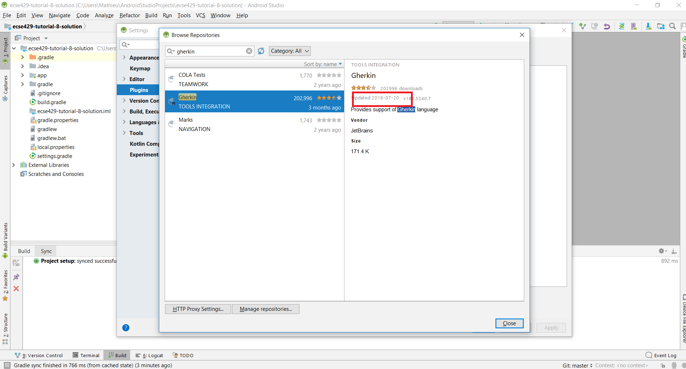
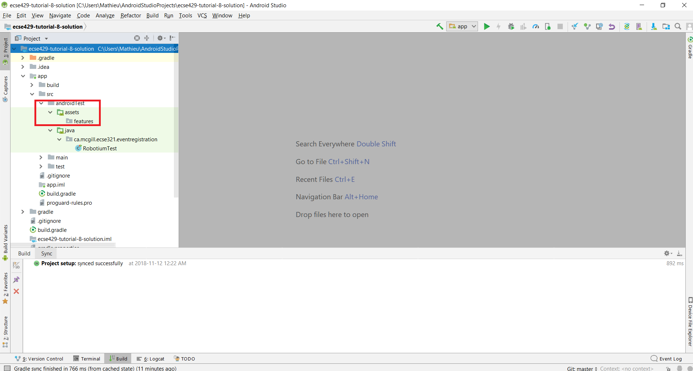
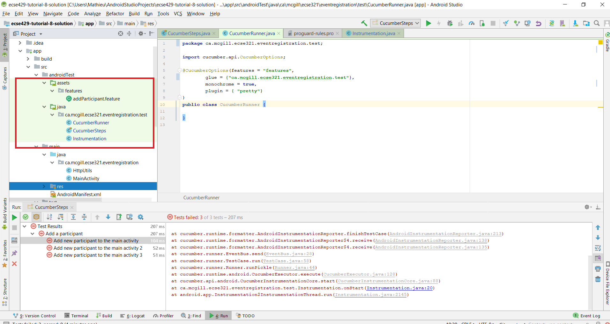
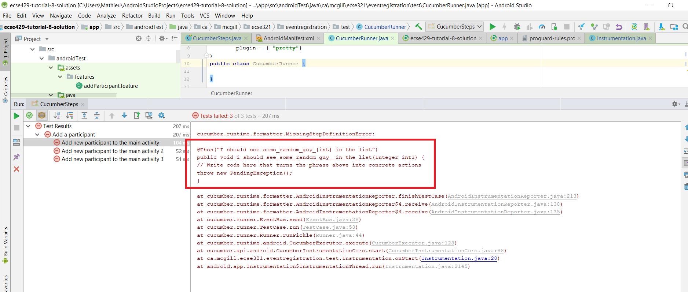
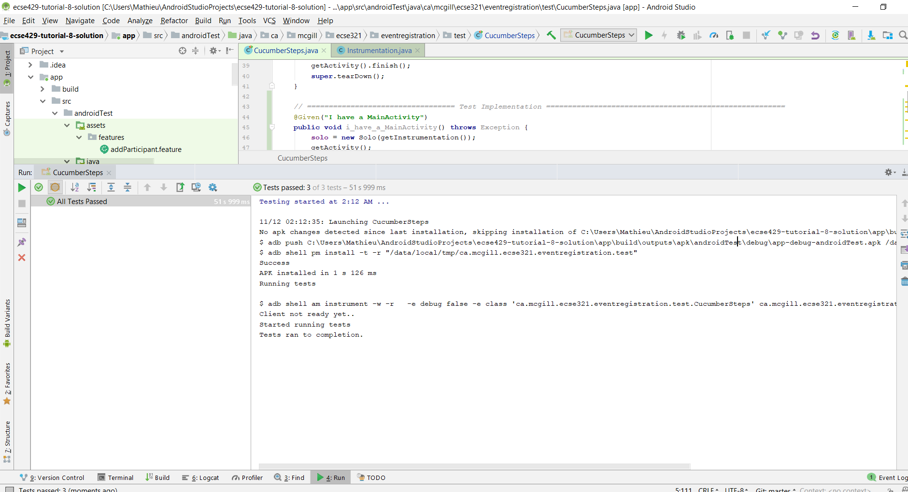
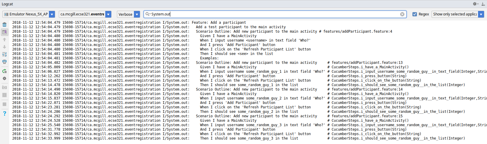

This tutorial shows how you can write acceptance test using the link:https://github.com/cucumber/cucumber-jvm[Cucumber tool] in a Behaviour-Driven Development approach.

. Clone the initial Android project from link:https://github.com/McGill-ECSE429-Fall2018/ecse429-tutorial-9[here] and import it to Android Studio

. Install the link:https://plugins.jetbrains.com/plugin/7211-gherkin[Gherkin] plugin for Android Studio +
Click on _File_ > _Settings_ > _Plugins_ > _Browse Repositories_ +
 +

. Type _Gherkin_ in search box, install it and restard Android Studio. +
 +

. Under `androidTest` folder, create a new folder structure `androidTest/assets/features` +
  +

. Add a new file called `addParticipant.feature` in the features folder
+
[source,gherkin]
----
Feature: Add a participant
  Add a test participant to the main activity

  Scenario Outline: Add new participant to the main activity
    Given I have a MainActivity
    When I input username <username> in text field 'Who?'
    And I press 'Add Participant' button
    When I click on the 'Refresh Participant List' button
    Then I should see <see> in the list

    Examples:
      | username          | see               |
      | some_random_guy_1 | some_random_guy_1 |
      | some_random_guy_2 | some_random_guy_2 |
      | some_random_guy_3 | some_random_guy_3 |
----

. Add the following lines  to the app's `build.gradle` file within the `android` tags
+
[source,gradle]
----
android {
    // ...  
    defaultConfig {
        // ...
        testInstrumentationRunner "ca.mcgill.ecse321.eventregistration.test.Instrumentation"
        // ...
    }
    // ...

    sourceSets {
        androidTest {
            assets {
                assets.srcDirs = ['src/androidTest/assets']
            }
            java {
                java.srcDirs = ['src/androidTest/java']
            }
        }
    }
    // ...

    compileOptions {
        // ...
        sourceCompatibility = '1.8'
        targetCompatibility = '1.8'
        // ...
    }
}
----

. Add the following lines in `dependencies` section
+
[source,gradle]
----
dependencies {
    // ...

    //Runner
    androidTestImplementation( 'com.android.support.test:runner:0.4.1' ){
        exclude module: 'junit'
    }
    androidTestImplementation 'io.cucumber:cucumber-junit:3.0.2'
    androidTestImplementation group: 'io.cucumber', name: 'cucumber-android', version: '3.0.2'
    androidTestImplementation 'io.cucumber:cucumber-picocontainer:3.0.2'
    androidTestImplementation group: 'io.cucumber', name: 'cucumber-jvm', version: '3.0.2', ext: 'pom'
    androidTestImplementation 'io.cucumber:cucumber-core:3.0.2'
    androidTestImplementation 'io.cucumber:cucumber-jvm-deps:1.0.6'
    // ...
}
---- 
+
NOTE: For convenience, below is the full specification of the `app.gradle` file
+
[source,gradle]
----
apply plugin: 'com.android.application'

android {
    compileSdkVersion 28
    defaultConfig {
        applicationId "ca.mcgill.ecse321.eventregistration"
        minSdkVersion 18
        targetSdkVersion 28
        versionCode 1
        versionName "1.0"
        testInstrumentationRunner "ca.mcgill.ecse321.eventregistration.test.Instrumentation"
    }
    buildTypes {
        release {
            minifyEnabled false
            proguardFiles getDefaultProguardFile('proguard-android.txt'), 'proguard-rules.pro'
        }
    }
    useLibrary 'android.test.runner'
    useLibrary 'android.test.base'
    useLibrary 'android.test.mock'

    sourceSets {
        androidTest {
            assets {
                assets.srcDirs = ['src/androidTest/assets']
            }
            java {
                java.srcDirs = ['src/androidTest/java']
            }
        }
    }
    compileOptions {
        sourceCompatibility = '1.8'
        targetCompatibility = '1.8'
    }
}

dependencies {
    implementation fileTree(dir: 'libs', include: ['*.jar'])
    implementation 'com.android.support:appcompat-v7:28.0.0'
    implementation 'com.android.support.constraint:constraint-layout:1.1.3'
    implementation 'com.android.support:design:28.0.0'
    testImplementation 'junit:junit:4.12'

    implementation 'com.loopj.android:android-async-http:1.4.9'

    implementation 'com.jayway.android.robotium:robotium-solo:5.2.1'

    //Runner
    androidTestImplementation( 'com.android.support.test:runner:0.4.1' ){
        exclude module: 'junit'
    }

    androidTestImplementation 'io.cucumber:cucumber-junit:3.0.2'
    androidTestImplementation group: 'io.cucumber', name: 'cucumber-android', version: '3.0.2'
    androidTestImplementation 'io.cucumber:cucumber-picocontainer:3.0.2'
    androidTestImplementation group: 'io.cucumber', name: 'cucumber-jvm', version: '3.0.2', ext: 'pom'
    androidTestImplementation 'io.cucumber:cucumber-core:3.0.2'
    androidTestImplementation 'io.cucumber:cucumber-jvm-deps:1.0.6'
}
----

. Sync after making the changes to the `app.gradle` file

. Delete the current implementation of `RobotiumTest` in the `java` folder

. Refactor or create a new package named `ca.mcgill.ecse321.eventregistration.test` under `androidTest/java`

. Create a new class named `Instrumentation` in the `ca.mcgill.ecse321.eventregistration.test` package with the following code
+
[source,java]
----
package ca.mcgill.ecse321.eventregistration.test;

import android.os.Bundle;

import cucumber.api.android.CucumberInstrumentationCore;
import android.support.test.runner.AndroidJUnitRunner;

public class Instrumentation extends AndroidJUnitRunner {
    private final CucumberInstrumentationCore instrumentationCore = new CucumberInstrumentationCore(this);

    @Override
    public void onCreate(Bundle arguments) {
        super.onCreate(arguments);
        instrumentationCore.create(arguments);
    }

    @Override
    public void onStart() {
        waitForIdleSync();
        instrumentationCore.start();
    }
}
----

. Create a new class named `CucumberRunner` in the `ca.mcgill.ecse321.eventregistration.test` package with the following code
+
[source,java]
----
package ca.mcgill.ecse321.eventregistration.test;

import cucumber.api.CucumberOptions;

@CucumberOptions(features = "features",
        glue = {"ca.mcgill.ecse321.eventregistration.test"},
        monochrome = true,
        plugin = { "pretty"}
)
public class CucumberRunner {
}
----

. Create a new class `CucumberSteps` again in the ``ca.mcgill.ecse321.eventregistration.test`. Your file structure should look like + 

. Add initializing code to `CucumberSteps`
+
[source,java]
----
package ca.mcgill.ecse321.eventregistration.test;

import android.test.ActivityInstrumentationTestCase2;

import com.robotium.solo.Solo;

import ca.mcgill.ecse321.eventregistration.MainActivity;

public class CucumberSteps extends ActivityInstrumentationTestCase2<MainActivity> {
    private Solo solo;

    private static final String LAUNCHER_ACTIVITY_FULL_CLASSNAME = "ca.mcgill.ecse321.eventregistration.MainActivity";
    private static Class<?> launcherActivityClass;

    static {
        try {
            launcherActivityClass = Class.forName(LAUNCHER_ACTIVITY_FULL_CLASSNAME);
        } catch (ClassNotFoundException e) {
            throw new RuntimeException(e);
        }
    }

    public CucumberSteps() throws ClassNotFoundException {
        super((Class<MainActivity>) launcherActivityClass);
    }

    @Override
    public void setUp() throws Exception {
        super.setUp();
    }

    @Override
    public void tearDown() throws Exception {
        solo.finishOpenedActivities();
        getActivity().finish();
        super.tearDown();
    }
}
----

. Run the tests under `CucumberSteps`. Take a look at the logs for the test failures +

. Add the following code to `CucumberSteps` to finish writing the tests
+
[source,java]
----
// ================================== Test Implementation =======================================================
@Given("I have a MainActivity")
public void i_have_a_MainActivity() throws Exception {
    solo = new Solo(getInstrumentation());
    getActivity();
}

@When("I input username some_random_guy_{int} in text field {string}")
public void i_input_username_some_random_guy__in_text_field(Integer int1, String string) {
    solo.waitForActivity("MainActivity", 2000);

    String username = "some_random_guy" + int1;

    EditText editText = solo.getEditText(string);
    solo.enterText(editText, username);
}

@When("I press {string} button")
public void i_press_button(String buttonName) {
    solo.waitForActivity("MainActivity", 2000);

    //click on button
    solo.clickOnText(buttonName);

    //make sure no error has been made
    boolean errorTextFound = solo.waitForText("exception", 1, 5000);
    assertFalse(errorTextFound);
}

@When("I click on the {string} button")
public void i_click_on_the_button(String buttonName) {
    solo.waitForActivity("MainActivity", 2000);

    //click on button
    solo.clickOnText(buttonName);
}

@Then("I should see some_random_guy_{int} in the list")
public void i_should_see_some_random_guy__in_the_list(Integer int1) {
    solo.waitForActivity("MainActivity", 2000);

    String expectedAddedParticipant = "some_random_guy" + int1;

    boolean textFound = solo.waitForText(expectedAddedParticipant, 1, 5000, true);
    assertTrue(textFound);
}
----

. Finally, rerun the tests under `CucumberSteps` +

. Under the _Logcat_ tab you can filter the view to see the output of Cucumber +

