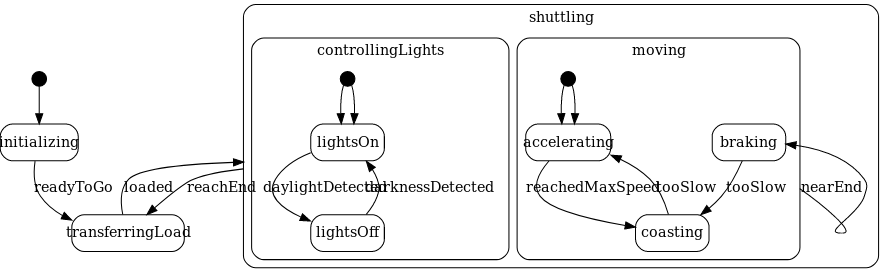
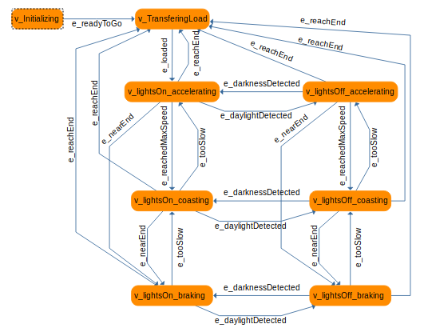

=== GraphWalker

For reference, the main documentation for GraphWalker is accessible at http://graphwalker.github.io/.

=== Setting up GraphWalker

. Download the Latest stable standalone CLI (3.4.2) jar file from link:http://graphwalker.github.io/download/[here].

. We assume that the `GRAPHWALKER` environment variable points to the jarfile (e.g., it points to `/home/user/graphwalker-cli-3.4.2.jar`). See its help by running
+
[source,java]
----
java -jar $GRAPHWALKER --help
----

=== Creating a test model

We are going to create a test model using the online UMPLE tool.

. Go to https://cruise.eecs.uottawa.ca/umpleonline/

. Insert the following example state machine code describing the possible states of a shuttler and insert it into the text editor (example taken from link:http://cruise.eecs.uottawa.ca/umple/StateMachineRegions.html[here])
+
[source,none]
----
class TrackShuttler {
  sm {
    initializing {
      readyToGo -> transferringLoad;
    }
    transferringLoad {
      loaded -> shuttling;
    }
    shuttling {
      reachEnd -> transferringLoad;
      moving {
        nearEnd -> braking;
        accelerating {
          reachedMaxSpeed -> coasting;
        }
        coasting {
          tooSlow -> accelerating;
        }
        braking {
          tooSlow -> coasting;
        }
      }
      ||
      controllingLights {
        lightsOn {
          daylightDetected -> lightsOff;
        }
        lightsOff {
          darknessDetected -> lightsOn;
        }
      }
    }
  }
}
----
+

. Take a look what code is generated by the tool based on the statechart!

. Using the link:https://www.yworks.com/yed/[yEd tool], create the flattened version of the state machine +
 +
[NOTE]
You can download the resulting graphml link:figs/shuttler.graphml[from here]

=== Test generation

. Use the GraphWalker tool to generate a test sequence based on your criteria. For example, to generate _full vertex coverage_ by applying a _random walk_ strategy, use 
+
[source,bash]
----
java -jar $GRAPHWALKER offline --model shuttler.graphml "random(vertex_coverage(100))" --start-element v_Initializing
----
+
Output:
+
[source,none]
----
{"currentElementName":"v_Initializing"}
{"currentElementName":"e_readyToGo"}
{"currentElementName":"v_TransferingLoad"}
{"currentElementName":"e_loaded"}
{"currentElementName":"v_lightsOn_accelerating"}
{"currentElementName":"e_daylightDetected"}
{"currentElementName":"v_lightsOff_accelerating"}
{"currentElementName":"e_reachEnd"}
{"currentElementName":"v_TransferingLoad"}
{"currentElementName":"e_loaded"}
{"currentElementName":"v_lightsOn_accelerating"}
{"currentElementName":"e_nearEnd"}
{"currentElementName":"v_lightsOn_braking"}
{"currentElementName":"e_daylightDetected"}
{"currentElementName":"v_lightsOff_braking"}
{"currentElementName":"e_tooSlow"}
{"currentElementName":"v_lightsOff_coasting"}
{"currentElementName":"e_tooSlow"}
{"currentElementName":"v_lightsOff_accelerating"}
{"currentElementName":"e_reachEnd"}
{"currentElementName":"v_TransferingLoad"}
{"currentElementName":"e_loaded"}
{"currentElementName":"v_lightsOn_accelerating"}
{"currentElementName":"e_daylightDetected"}
{"currentElementName":"v_lightsOff_accelerating"}
{"currentElementName":"e_darknessDetected"}
{"currentElementName":"v_lightsOn_accelerating"}
{"currentElementName":"e_reachedMaxSpeed"}
{"currentElementName":"v_lightsOn_coasting"}
----
+
[TIP]
Use the link:https://stedolan.github.io/jq/[jq tool] to prettify the output of the test generator. Pipe the results: +
+
[source,none]
----
GRAPHWALKER_COMMAND | jq -r .currentElementName
----

. Experiment with other setting, such as creating a test case from one node to another node with A* traversal! See more link:http://graphwalker.github.io/generators_and_stop_conditions/[here].

. link:http://graphwalker.github.io/MBT_How_to/[Other useful MBT resources]
