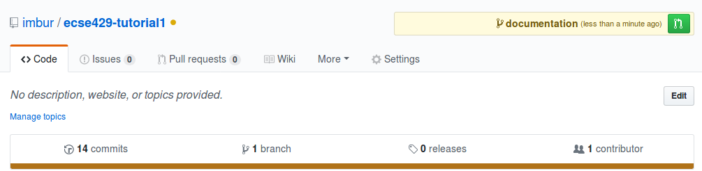
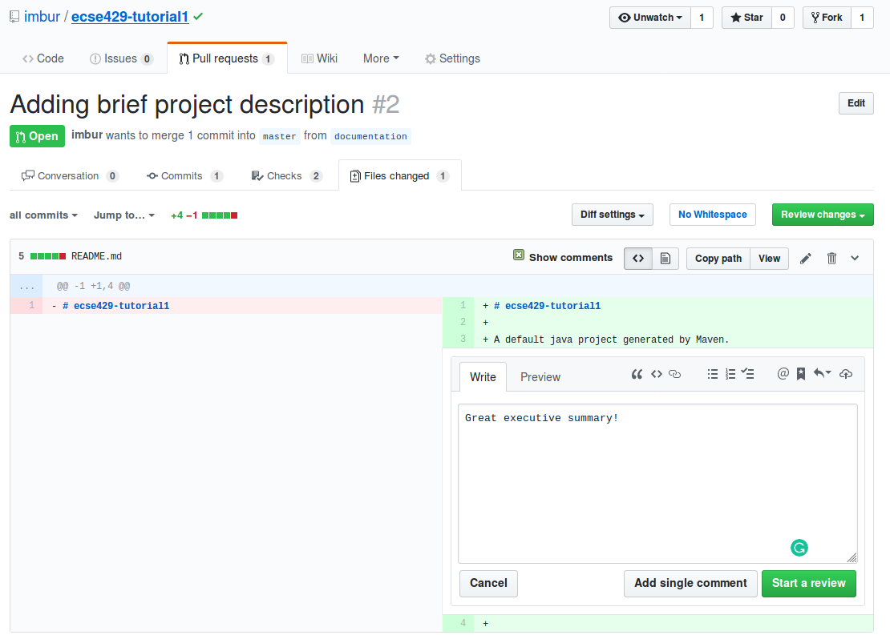

=== GitHub Code Reviews

. Navigate to the folder for the working copy of your _ecse429-tutorial1_ from the previous tutorial.

. Create & checkout a new branch named called `documentation`. (`git branch documentation && git checkout documentation` )

. Edit `README.md`. +
```
# ecse429-tutorial1

A default java project generated by Maven.

```

. Commit your changes and push this `documentation` branch. (`git add . && git commit -m "Adding brief project description" && git push`)

. Open the main page for the repository on Github. Click on the green button in the upper right corner to open a _pull request_. +


. Study the possible settings, then create the pull request. +
image:figs/pr-create.png[Open pull request page]

. On the next page, click on _Files changed_. Place a comment in the updated file and start a review. +


. Normally, the owner and the reviewer are two different participants, and GitHub offers more options when completing a review: _approve changes_ or _request changes_. This time simply click on _Finish review_ and _Comment_.

. Merge the pull request. Delete the branch afterwards. +
image:figs/github-merge.png[Merge pull request] 

=== Gerrit Code Reviews

. Go to http://gerrithub.io/, click on _First time Sign In_.

. Authenticate with GitHub, then select the repositories you want to replicate with Gerrit. It is best to select the the public _<<your GitHub user>>/ecse429-tutorial1_ repository created previously to follow the steps of this tutorial. 
[NOTE]
You can select repositories to replicate anytime by navigating to _gerrithub.io > Open Gerrit Code Review > GitHub (in the top menubar) > Repositories_

. Create a GerritHub password for HTTP access. Go to _your profile (upper right corner) > Settings > HTTP Password_, then click on _Generate password_. Make sure to save it somewhere, otherwise you need to generate it again next time.

. Click on _Projects > List_, then search for your repository. +
 

. Select your project named after your repository, then set the settings below and click on _Save Changes_. +
image:figs/gerrit-project-settings.png[Gerrit project settings]

. Copy the command from the `git clone` command shown above the _Description_ text box after changing to _Clone with commit-msg hook_ and _http_. +
image:figs/gerrit-clone.png[Gerrit clone]
[NOTE]
Optionally, if you have SSH key installed to GitHub, you can import it to GerritHub and use that for authentication.

. Paste the command to the terminal. Enter your generated password when prompted.

==== Making a Change with Gerrit

. Navigate to the repository. Edit the `.travis.yml` file:
+
[source]
----
language: java
install: true
script:
 - cd tutorial1
 - mvn clean install
----

. Add, commit and push the changes. (One-liner: `git add . && git commit -m "Making Travis skip the install step" &&  git push`)

. Observe the created commit message with `git log`. Observe the changes synced to GitHub, too.

. Create a new change to the code, remove the recently added `install: true` line from `.travis.yml` and create a new commit. Do not push it yet!

. Issue `git push origin HEAD:refs/for/master`. The outpus should show that a new Gerrit change is created.
+
[sourcei,none]
----
Counting objects: 3, done.
Delta compression using up to 8 threads.
Compressing objects: 100% (3/3), done.
Writing objects: 100% (3/3), 1.01 KiB | 0 bytes/s, done.
Total 3 (delta 1), reused 0 (delta 0)
remote: Resolving deltas: 100% (1/1)
remote: Processing changes: new: 1, done    
remote: 
remote: New Changes:
remote:   https://review.gerrithub.io/#/c/imbur/ecse429-tutorial1/+/425671 Removing no-op install step from travis conf
remote: 
To https://imbur@review.gerrithub.io/a/imbur/ecse429-tutorial1
 * [new branch]      HEAD -> refs/for/master

----

. Navigate to your GerritHub dashboard. Observe the changes there. +

[NOTE]
GitHub does not sync Gerrit changes, since they are pushed to a gerrit-specific branch (`refs/for/<<branchname>>`).

==== Review and Manage a Change with Gerrit

. Click on the change and explore the options on the web interface. +


. Comment on the `.travis.yml` file within the change suggesting that JDK8 should be used with the project. +


. The comment will remain a draft up to the point until you submit your review. Click on the _Reply..._ button on the overview page for the change. +


. Implement the modifications.
+
[source]
----
language: java
jdk:
 - oraclejdk8
script:
 - cd tutorial1
 - mvn clean install
----

. Append these modifications to the change
+
[source,none]
----
> git add .
> git commit --amend
> git push origin HEAD:/refs/for/master
----
+
[CAUTION]
It is very important to add that in git amending a pushed commit is a history-rewriting operation, that is in most cases to be avoided. However, Gerrit follows these changes by amending a previous commit that holds the previous version of the change.

. Observe the new patch set online. +


. Approve and verify the change. +
image:figs/gerrit-approve.png[Gerrit approving a change]

. Submit the changes to the `master` branch. +
image:figs/gerrit-submit.png[Submit change to master]

. Soon the commit becomes visible in GitHub as well. Make sure to pull afterwards to update your local branches.
