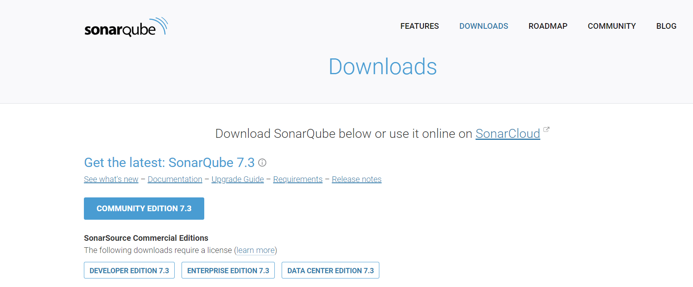
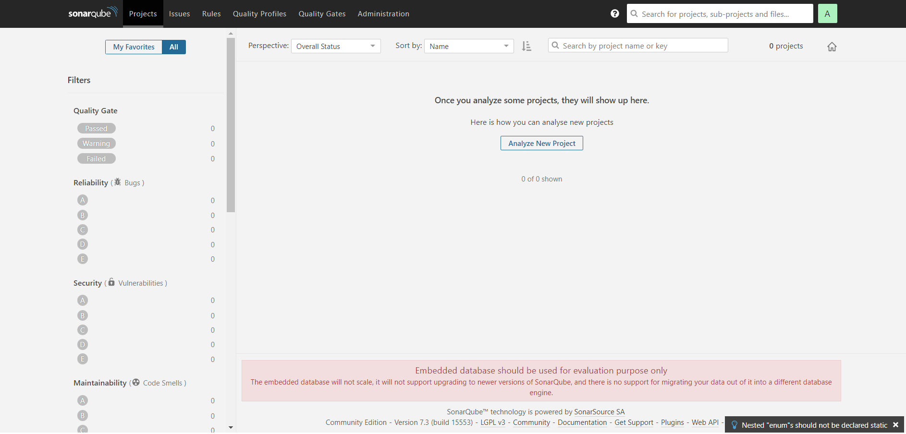
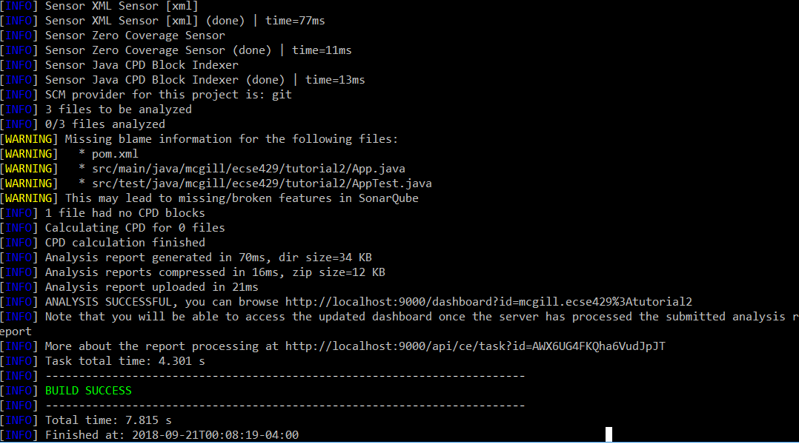
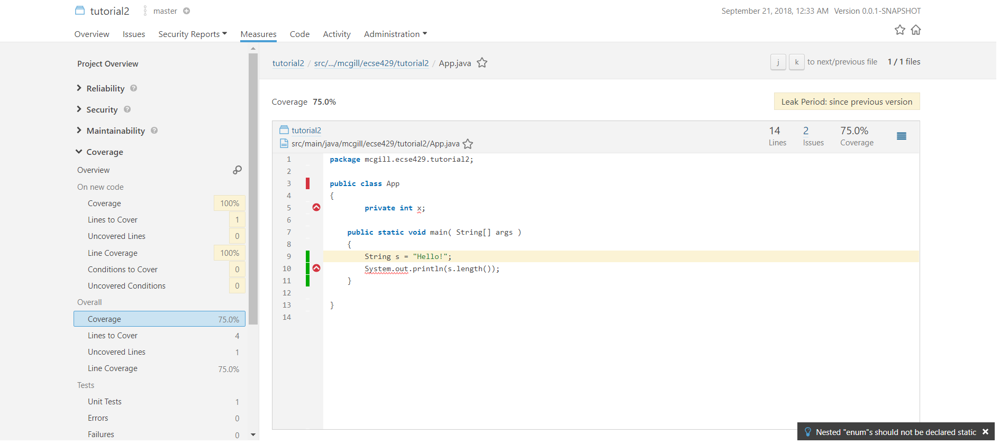
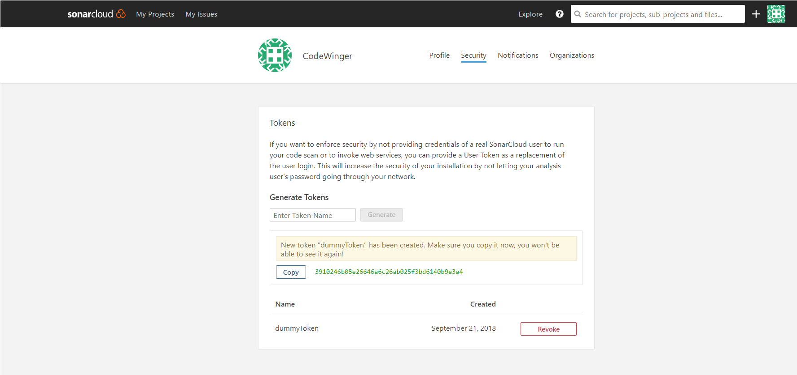
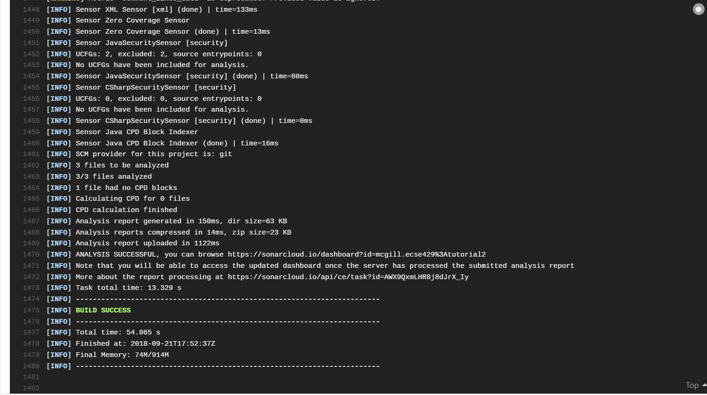
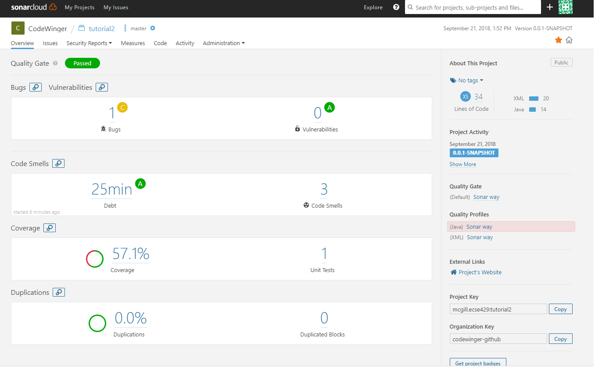
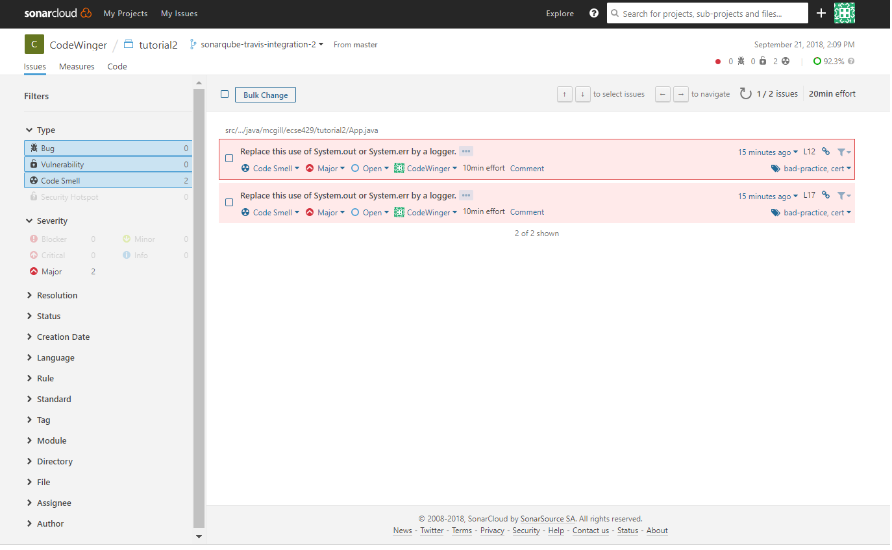

=== Prerequisites

This tutorial assumes that you have `maven` version 3.x.x installed on your computer and a default maven project created. 

=== SonarQube Static Code Analysis

This section looks at how to use SonarQube, both integrated with Travis and as a standalone setup.

==== Offline SonarQube Installation

. Navigate to the folder of the working copy of your repository used during the previous tutorial. If you no longer keep a working copy, clone it again.

. Create a new branch from master to use `git branch sonarqube-standalone && git checkout sonarqube-standalone` 

. Go to the SonarQube main page (https://www.sonarqube.org/) and click on the blue _Download_ button.
	image:figs/sonarQube1.png[Download SonarQube]

. Click on the blue _Community Edition 7.3_ button + 

. Extract the sonarqube-7.3.zip to the location of your choice. 
  For this tutorial, we unzipped it in C:\

. Start the SonarQube Server  

Assuming you are in the root folder of the sonarqube directory, that is `C:\sonarqube-7.3` this example, you run either:  

`.\bin\[OS]\StartSonar.bat` for windows or `./bin/[OS]/sonar.sh console` for linux or mac environments. 

The OSs that are included are:  

* windows-x86-32  
* windows-x86-64  
* macosx-universal-64  
* linux-x86-32  
* linux-x86-64  

In this example, we have a Windows machine, so we use `.\bin\windows-x86-64\StartSonar.bat` as a command. The server should boot and when it is finally ready, you should get an output similar to this  

image:figs/sonarQube3.png[SonarQube terminal ready]  

SonarQube created a default webserver at localhost:9000. If you type the latter in your Internet browser, you should get the following page  

image:figs/sonarQube4.png[SonarQube About Page]  

7 Log in the server

[NOTE]
The default account created for your page is admin:admin

+

8 Create Basic Code Smells in the Project

Locate the file `App.java` in your maven project and change the class definition to the following

[Source]
----
public class App 
{
    private int x;
	
    public static void main( String[] args )
    {
    	String s = null;
    	System.out.println(s.length());
    }

}
----

9 Create an Empty Test Suite in `AppTest.java`

[Source]
----
import org.junit.Test;

public class AppTest 
{
    @Test
    public void emptyTest() {
    
    }
}
----

10 Edit the `pom.xml`

* Add JUnit dependency 
[source, none]
----
...
<dependencies>
	...
	<dependency>
		<groupId>junit</groupId>
		<artifactId>junit</artifactId>
		<version>4.12</version>
	</dependency>
</dependencies>
...
----  
* Add the Sonar Maven plugin and its configuration to the project (e.g., after the `</dependencies>` closing tag)
+
[source,none]
----
...
<build>
	<plugins>
		<plugin>
			<groupId>org.sonarsource.scanner.maven</groupId>
			<artifactId>sonar-maven-plugin</artifactId>
			<version>3.5.0.1254</version>
		</plugin>
	</plugins>
</build>

<profiles>
	<profile>
		<id>sonar</id>
		<activation>
			<activeByDefault>true</activeByDefault>
		</activation>
		<properties>
		<!-- Optional URL to server. Default value is http://localhost:9000 -->
			<sonar.host.url>
				http://localhost:9000
			</sonar.host.url>
		</properties>
	</profile>
</profiles>
...
----

11 Build the Project

In another terminal, run the command `mvn clean install sonar:sonar` at the root of the project folder

You should get an output similar to this:

If we visit the link in the terminal output (it follows the format of http://localhost:9000/dashboard?id=<INSERT_PROJECT_NAME>), we are brought to a page similar to this:

image:figs/sonarQube7.png[SonarQube Web Output]

12 Investigate the Error Causes:

Click on _Code_ in the toolbar above. Then select the package containing the `App.java` class from the list and click on `App.java` and click on the red icons on the left of your code.

image:figs/sonarQube8.png[App errors]

===== Adding Code Coverage

. Edit the `pom.xml` and add a new `profile` somewhere between the `<profiles>` tags
+
[source,none]
----
<profile>
<id>sonar-coverage</id>
<activation>
<activeByDefault>true</activeByDefault>
</activation>
<build>
<pluginManagement>
  <plugins>
    <plugin>
      <groupId>org.jacoco</groupId>
      <artifactId>jacoco-maven-plugin</artifactId>
      <version>0.7.8</version>
    </plugin>
  </plugins>
</pluginManagement>
<plugins>
  <plugin>
    <groupId>org.jacoco</groupId>
    <artifactId>jacoco-maven-plugin</artifactId>
    <configuration>
      <append>true</append>
    </configuration>
    <executions>
      <execution>
	<id>agent-for-ut</id>
	<goals>
	  <goal>prepare-agent</goal>
	</goals>
      </execution>
      <execution>
	<id>jacoco-site</id>
	<phase>verify</phase>
	<goals>
	  <goal>report</goal>
	</goals>
      </execution>
    </executions>
  </plugin>
  </plugins>
  </build>
</profile>
----

. Write a Dummy Test

In `AppTest.java`, substitute `emptyTest` with the following:

[Source]
----
@Test
public void mainTest() {
    App.main(null);
}
----

3 Run the command `mvn clean install sonar:sonar` once again

4 Use the outputted URL to inspect the changes in SonarQube +

image:figs/sonarQube9.png[SonarQube Offline Code Coverage]

5 Click on the `75%` of the `Code Coverage` Section

6 Click on the `App.java` file in the list

7 Look to the left of the red error icons. We now see which lines were tested by the unit tests. +

==== SonarQube Integrated With Travis
. Register your Github Account in this link (https://sonarcloud.io/sessions/new?return_to=%2Faccount%2Fsecurity) +
image:figs/sonarQube-ci-1.png[SonarCloud Login page]

image:figs/sonarQube-ci-2.png[SonarCloud Token Generation Page]

.Add a security token of your choice and store in a file of your choice
[NOTE]
It is important to copy it somewhere; you will not be able to see it again afterwards + 

3 Click on your picture in the top right-hand side of the toolbar, next to the search bar, then on the button _My Organizations_ 

image:figs/sonarQube-ci-4.png[My Organization]

4 Jot down the key given by SonarCloud.io under the _Create_ button.

5 Edit the `.travis.yml` file
[source,none]
----
language: java
sudo: false
install: true

addons:
  sonarcloud:
    organization: "[YOUR ORGANIZATION KEY]"
    token:
      secure: "[YOUR GENERATED TOKEN]"
   

jdk:
  - oraclejdk8

script:
  - mvn clean org.jacoco:jacoco-maven-plugin:prepare-agent package sonar:sonar

cache:
  directories:
    - '$HOME/.m2/repository'
    - '$HOME/.sonar/cache'
----

For this example, the `addons` section would look like
[source,none]
----
addons:
  sonarcloud:
    organization: "codewinger-github"
    token:
      secure: "3910246b05e26646a6c26ab025f3bd6140b9e3a4"
----

6 Push your work from the `master` branch to GitHub with the command `git add . && git commit -m "SonarCloud Integration" & git push` 

[NOTE]
We need to first analyze the `main` branch before we can analyze new branches along with their differences with the `master` branch 
Your output should look something like this:

7 Copy the outputted URL (https://sonarcloud.io/dashboard?id=mcgill.ecse429%3Atutorial2, in this case) and paste it in your Internet browser. +

8 From the `master` branch, create and checkout a new branch `git branch sonarqube-travis-integration && git checkout sonarqube-travis-integration`

9 Modify `App.java`'s class definition:

[source,java]
----
public class App 
{
    public static void main( String[] args )
    {
    	if (args == null || args.length == 0) {
    		System.out.println("no input");
    		return;
    	} 
    	
    	for (String argument : args) {
    		System.out.println(argument);
    	}
    }
}
----
10 Modify `AppTest.java`'s class definition:

[source,java]
----
import org.junit.Test;

public class AppTest 
{
	@Test
	public void testMainMethodForNull() {
		App.main(null);
	}
	
	@Test
	public void testMainMethodForEmptyArray() {
		App.main(new String[0]);
	}
	
	@Test
	public void testMainMethodForNonEmptyArray() {
		String[] args = {"Hello", "World"};
		App.main(args);
	}
}
----

11 Push your work on the branch and check the output in SonarCloud.io (`git add . && git commit -m "SonarCloud Integration" & git push -u origin sonarqube-travis-integration`

=== Infer Static Analyzer

. Create and checkout a new branch from master (`git branch infer && git checkout infer`) 

. Edit the .travis.yml file: 
+
[source,none]
----
dist: trusty
sudo: required
language: java
jdk: oraclejdk7

script:
 - #TODO: get infer archive and extract it
 - #TODO: add infer executable to the path
 - #TODO: invoke infer with your project
----

. Introduce a null warning
In the default file `App.java`, change the main method to the following:
+
[source,java]
----
public static void main( String[] args ) {
    String s = null;
    System.out.println(s.length());
}
----

. Commit and push the 2 modified files (`commit add . && git commit -m "Added Infer Static Analyzer" && git push -u origin infer`)

. Go to https://travis-ci.com/ to see your build processes.
