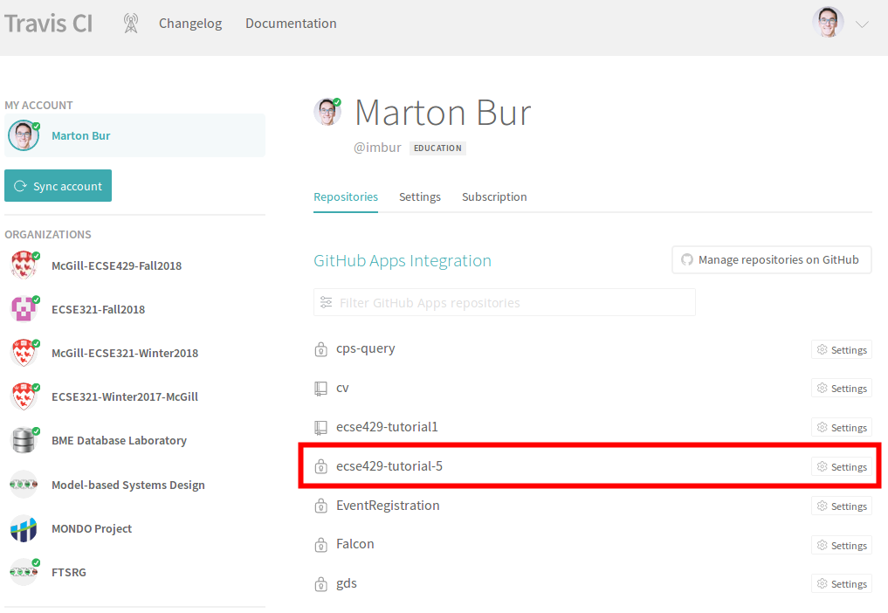
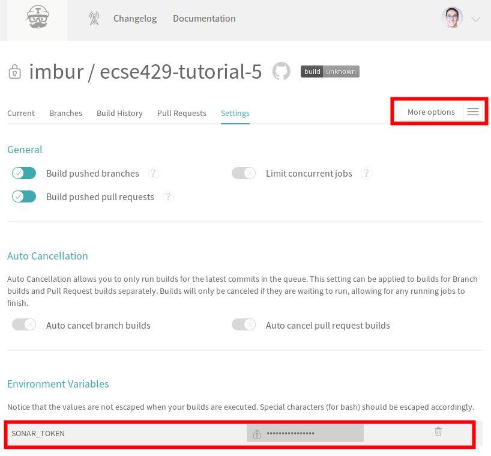
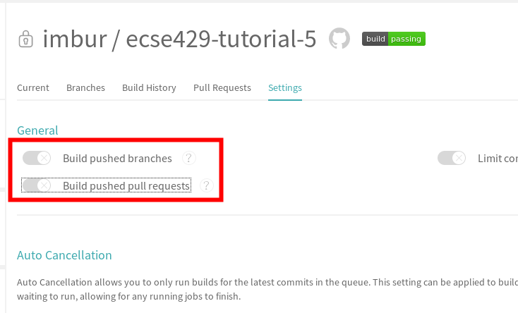
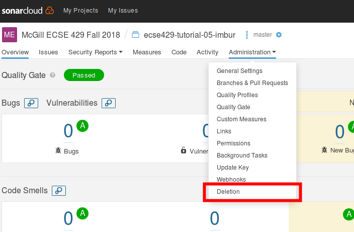

=== EvoSuite Installation and Initial Project Setup
[NOTE]
For this session, we are reusing a sligthly modified version of the example project link:https://github.com/cseppento/gradle-evosuite-plugin/tree/master/test-projects/simple[available here]. +

. Download EvoSuite Commandline tool from http://www.evosuite.org/downloads/

. Fork the link:https://github.com/McGill-ECSE429-Fall2018/ecse429-tutorial-5[ecse429-tutorial-5] repository *under your GitHub user*. +
[IMPORTANT]
After creating your fork, it is important to apply the steps below to your own fork (and not on the organization's repository).

. Go to https://travis-ci.com/account/repositories and make sure you see the fork on Travis. If not, synchronize with GitHub. +

. Click on _Settings_ with the cogs icon next to the repository's name. Under _More options > Settings_ Set the value of the `SONAR_TOKEN` environment variable (the value is the token obtained from sonarcloud.io earlier) for *your fork's* build. +

. Clone your fork of the repository to your computer.

. Replace *both* `project.key` and `project.name` properties in `.travis.yml` with `ecse429-tutorial-5-YOUR_GITHUB_USERNAME`. Commit and push your changes afterwards and see your project automatically built on Travis-CI and analyzed on SonarCloud.

=== Generating Tests using EvoSuite
[NOTE]
In the following steps, we assume that the `EVOSUITE` environment variable points to the evosuite.jar executable, and the program can be started by issuing `java -jar $EVOSUITE`. For Windows: in the default Windows command line tool this would be `java -jar %EVOSUITE%`, while also make sure that the firewall settings allow EvoSuite to run.

. Navigate to the folder where your working copy of your tutorial 5 repository is located.

. Explore the project sources.

. Build the project locally using `./gradlew build` to generate classfiles.

. You can run the app with `./gradlew run`.

. Go to the folder `simple/` and generate tests for the class `SimpleStaticSut`
+
[source,bash]
----
java -jar $EVOSUITE -class com.github.cseppento.gradle.evosuite.testprojects.simple.SimpleStaticSut -projectCP build/classes/java/main/ -Duse_separate_classloader=false
----

. Explore the switches for EvoSuite with `java -jar $EVOSUITE -help`! Also observe the output of `java -jar $EVOSUITE -listParameters`!

. Go to (or stay in) the folder `simple/` and generate tests for the class `SimpleObjectSut` with Branch coverage and also print the all test goals as well as the missed goals.
+
[source,bash]
----
java -jar $EVOSUITE -class com.github.cseppento.gradle.evosuite.testprojects.simple.SimpleObjectSut -projectCP build/classes/java/main/ -Duse_separate_classloader=false -criterion BRANCH -Dprint_goals=true -Dprint_missed_goals
----

. Try other settings according to link:https://github.com/EvoSuite/evosuite/wiki/Tutorial%3A-Part-1--Evosuite-on-the-Command-Line#playing-with-evosuite-settings[EvoSuite documentation] to generate tests for the `SimpleObjectSut` class!

=== Adding the Generated Tests to the Build

. Tests are generated under `simple/evosuite-tests`. We need to add them to the build.

. First, add EvoSuite runtime to project dependencies to `simple/simple-deps.gradle`: `implementation 'org.evosuite:evosuite-standalone-runtime:1.0.6'`

. Modify the test sources list in `simple/simple-app.gradle` by adding the following lines to the end of the file:
+
[source,gradle]
----
sourceSets {
    test {
        java {
            srcDirs = ['./src/test/java' ,'./evosuite-tests']
        }
    }
}
----

=== Cleaning Up the Project

**IMPORTANT**: At the end of the tutorial, turn off the build on Travis-CI and delete the project in SonarCloud as shown below, so that this demo project is not taking up the allowed line count on SonarCloud +
_Travis_: +
 +
_SonarCloud_: +

