=== Mutation Testing Using PIT

This tutorial covers the basics of using PIT (link:http://pitest.org/), both as part of a build using gradle and using an eclipse plugin.

[NOTE]
For this tutorial, we assume that you the gradle eclipse pluging installed on your computer.

[NOTE]
We will create a gradle project from scratch and be testing the method from the fourth question of your first assignment _ReturnAverage(int[], int, int, int)_ . 

. Create a new gradle project in Eclipse by clicking on _File_ > _New_ > _Other_ +
image:figs/pit-testing-fig-1.png[New Project]

. Under _Gradle_, choose Gradle Project +
image:figs/pit-testing-fig-2.png[New Gradle Project]

. Click on _Next_, _Next_, then name your project _tutorial6_, click on _Finish_ +
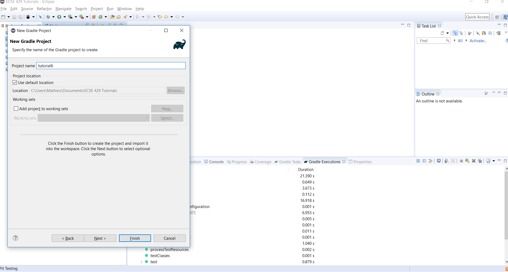 +
[NOTE]
The project may take some time to be created.

. Create new packages instead of the default ones for the source and test folders (e.g `com.mcgill.ecse429.tutorial6`) +
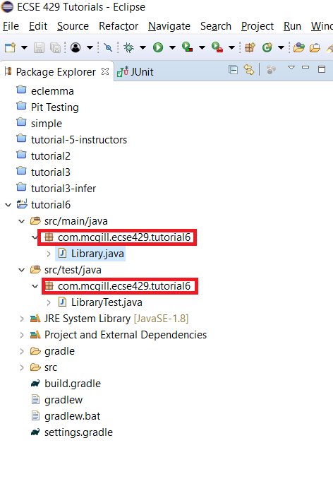

. Change the code in the `Library` class 
+
[source,java]
----
package com.mcgill.ecse429.tutorial6;

public class Library {
	
	public static double returnAverage(int value[], int arraySize, int MIN, int MAX) {
    	int index, ti, tv, sum;
    	double average;
    	index = 0; ti = 0; tv = 0; sum = 0;
    	while (ti < arraySize && value[index] != -999) {
    		ti++;
	    	if (value[index] >= MIN && value[index] <= MAX) {
		    	tv++;
		    	sum += value[index];
	    	}
	    	index++;
    	}
    	if (tv > 0)
    		average = (double) sum/tv;
    	else
    		average = (double) -999;
    	return average;
	 }
}
----

. Change the code in the `LibraryTest` class 
+
[source,java]
----
package com.mcgill.ecse429.tutorial6;

import static org.junit.Assert.assertEquals;

import org.junit.Test;

public class LibraryTest {
	
	@Test
	public void allBranchCoverageMinimumTestCaseForReturnAverageTest1() {
		int[] value = {5, 25, 15, -999};
		int AS = 4;
		int min = 10;
		int max = 20;		
		double average = Library.returnAverage(value, AS, min, max);
		assertEquals(15, average, 0.1);
	}
	
	@Test
	public void allBranchCoverageMinimumTestCaseForReturnAverageTest2() {
		int[] value = {};
		int AS = 0;
		int min = 10;
		int max = 20;		
		double average = Library.returnAverage(value, AS, min, max);
		assertEquals(-999.0, average, 0.1);
	}
}
----

. Run the Test in coverage mode using Eclemma. +
Verify that we have 100% branch coverage. +
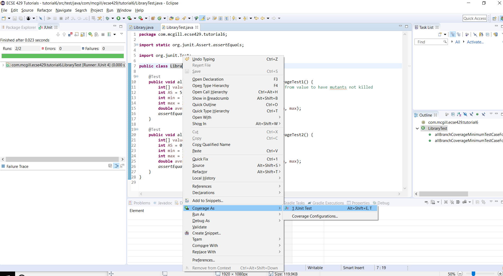

. Verify that we have all branch coverage +
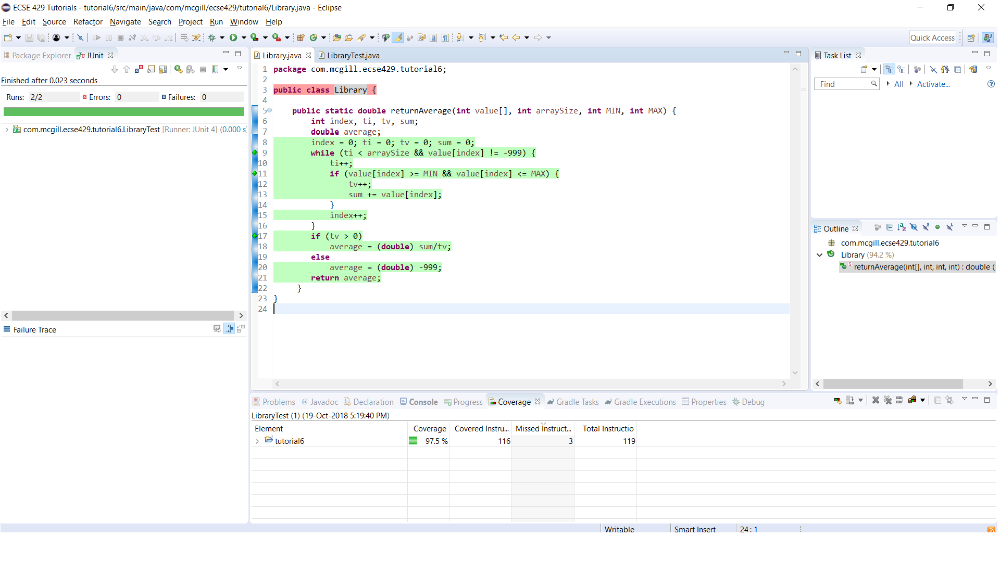

=== Using Gradle with PIT testing

. Modify the `build.gradle` file to include the pitest plugin 
+
[source,gradle]
----
apply plugin: 'java'
apply plugin: 'java-library'

sourceCompatibility = JavaVersion.VERSION_1_8

buildscript {
    repositories {
        jcenter()
    }
    dependencies {
        classpath 'info.solidsoft.gradle.pitest:gradle-pitest-plugin:1.3.0'
    }
}

repositories {
    jcenter()
}

dependencies {
    testCompile "junit:junit:4.12"

    compile "args4j:args4j:2.0.21"
    compile "org.codehaus.groovy:groovy-all:2.3.7"
}

apply plugin: 'info.solidsoft.pitest'

pitest {
    targetClasses = ["com.mcgill.ecse429.tutorial6*"]
    timestampedReports = true
}
----

. Navigate to the project folder and run the command `gradlew build pitest` +
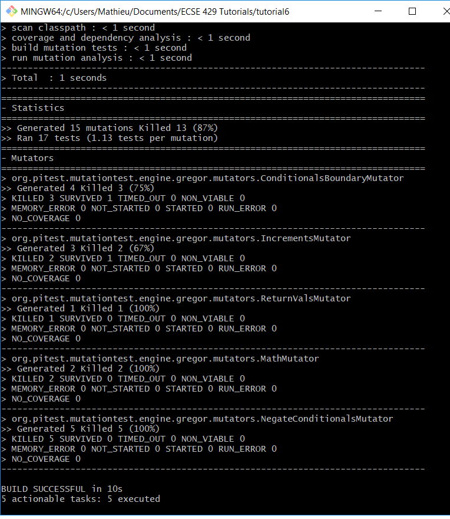

. In your projects root folder, open the file `./build/reports/pitests/index.html` +
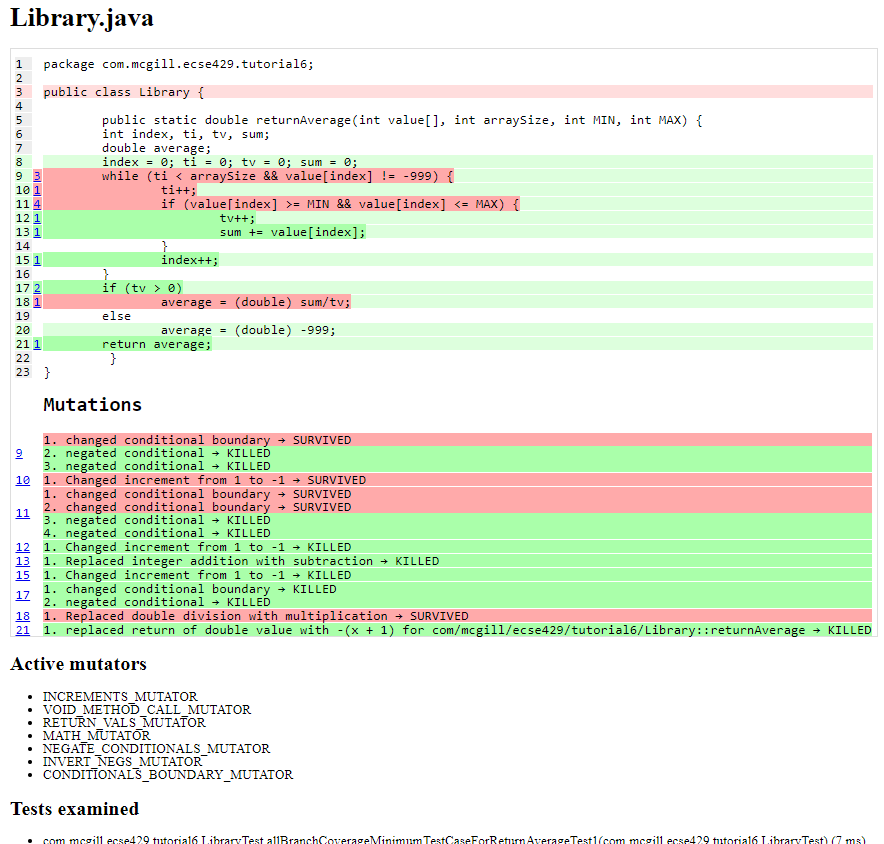 +
[NOTE]
You may have a different output as the one shown. This is normal as the types and number of mutants may vary each run.

. Look at the reports and get familiar with it. +
We can see the code coverage, the location where the mutations took place, the mutations themselves, the types of mutators and the test suite used to assess mutation score.

. From the ouput above, we update the test cases +
The test cases are not killing all mutants due to not checking `value[index] == MIN` and `value[index] == MAX` conditions in the boundary. A similar problem occurs for `ti == arraySize` in the while loop. `LibraryTest.java` now contains: 
+
[source,java]
----
package com.mcgill.ecse429.tutorial6;

import static org.junit.Assert.assertEquals;

import org.junit.Test;

public class LibraryTest {
	
	@Test
	public void allBranchCoverageMinimumTestCaseForReturnAverageTest1() {
		int[] value = {5, 25, 10, 20, -999};
		int AS = 5;
		int min = 10;
		int max = 20;		
		double average = Library.returnAverage(value, AS, min, max);
		assertEquals(15, average, 0.1);
	}
	
	@Test
	public void allBranchCoverageMinimumTestCaseForReturnAverageTest2() {
		int[] value = {};
		int AS = 0;
		int min = 10;
		int max = 20;		
		double average = Library.returnAverage(value, AS, min, max);
		assertEquals(-999.0, average, 0.1);
	}

}
----

. Rerun pit mutation with `gradlew build pitest` and reopen the outputted report `index.html` +
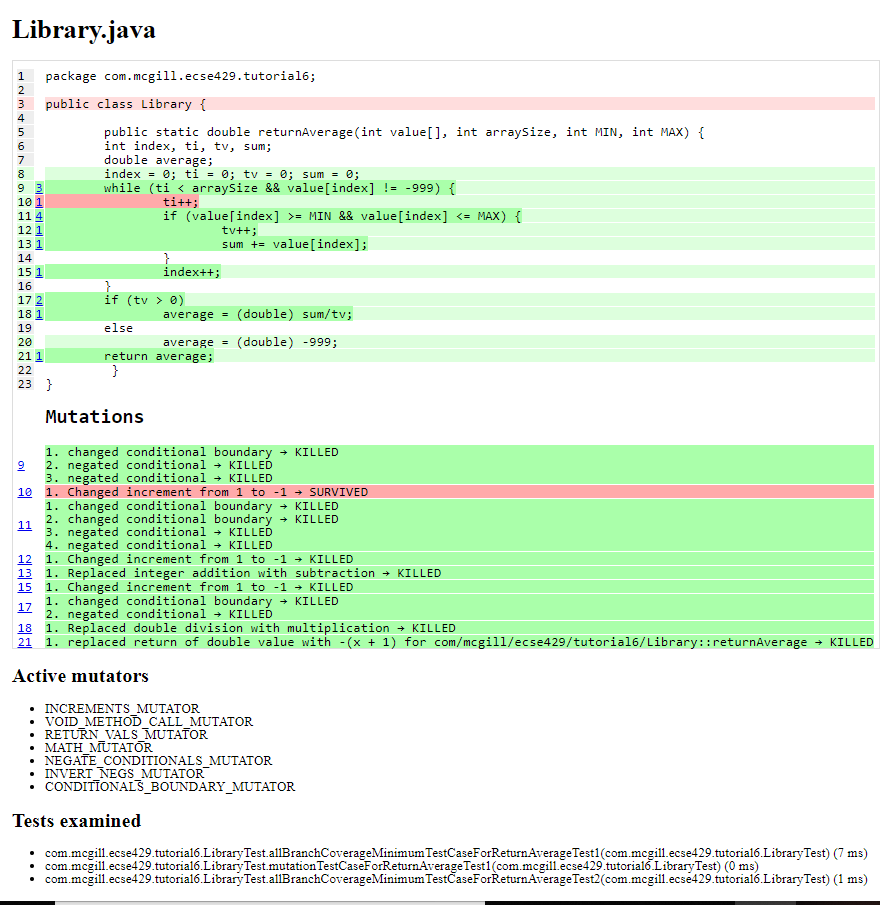

. After the second run, we see that the line `ti++;` inside the while loop is useless and a code smell!

=== Configuring PIT testing

. To understand the different mutants, you can go link:http://pitest.org/quickstart/mutators/[here].

. You can customize the plugin in the `builde.gradle` file using all the parameters for the command line. +
Reference: http://pitest.org/quickstart/commandline/

. For example, we can specify the mutators we want in `build.gradle`: 
+
[source,gradle]
----
...
pitest {
    targetClasses = ["com.mcgill.ecse429.tutorial6*"]
    timestampedReports = true
    mutators=['NEGATE_CONDITIONALS','CONDITIONALS_BOUNDARY']
}
...
----

=== Using PIT in Eclipse

. Go to _Help_ > _Eclipse Marketplace_ +
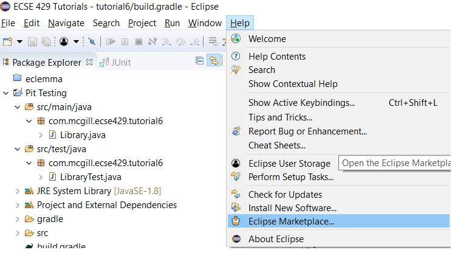

. Type _pit_ in the search box and find _Pitclipse_ + 
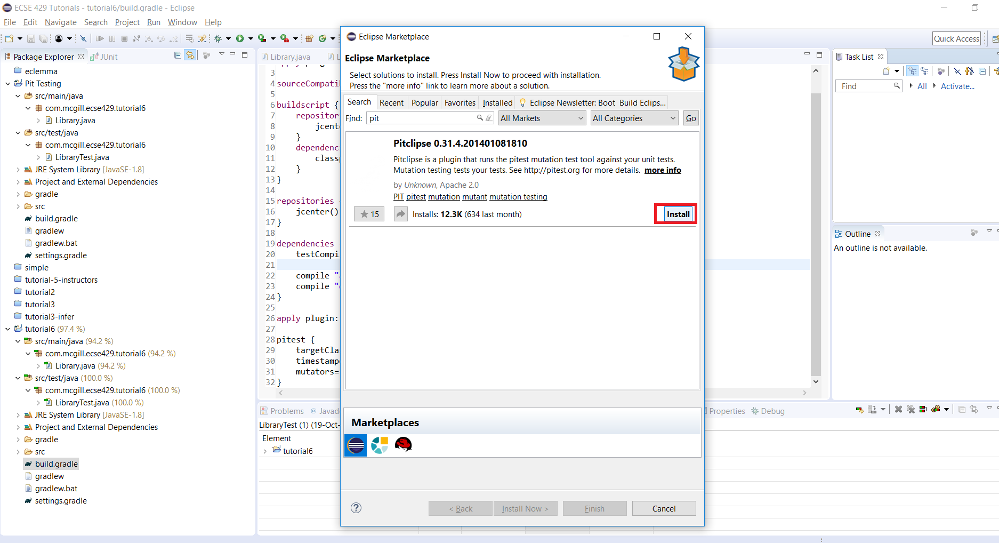

. Restart your Eclipse after the installation is successful

. You can now executet the tests in `LibraryTest` class by selecting _Pit Mutation Test_ from the available run configurations +
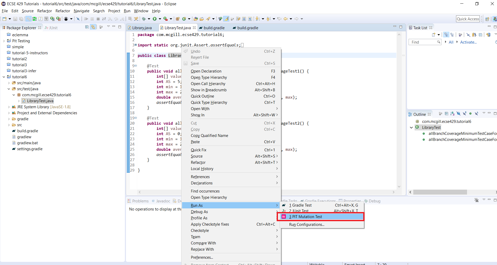

. Check the output in the console for where the report is generated. +
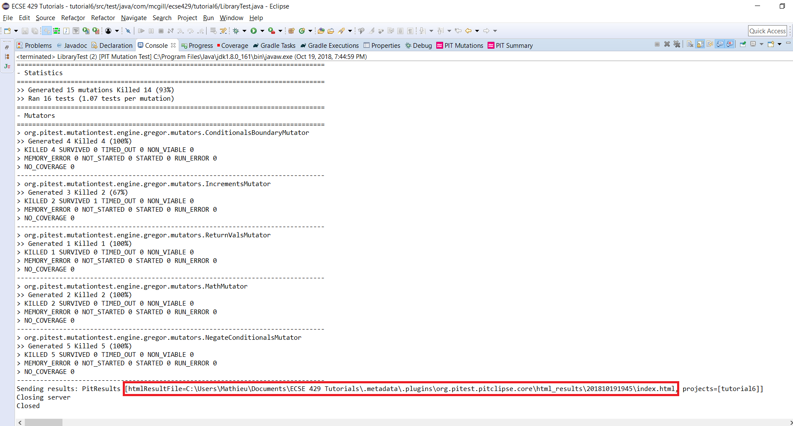 +
[NOTE]
The output of the report should be identical to the one we generated with the gradle plugin
